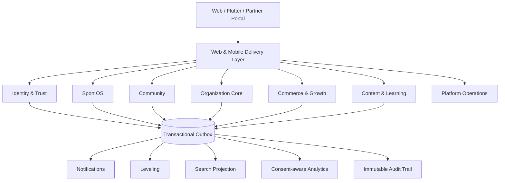
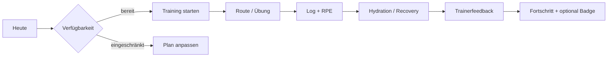
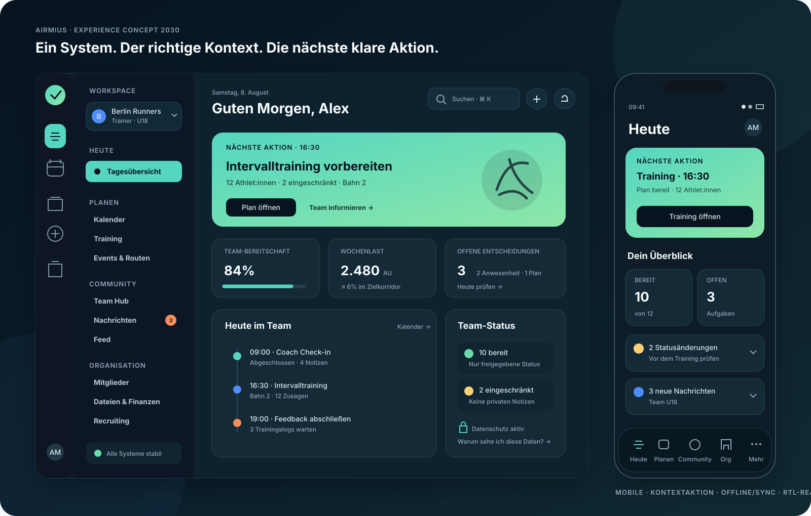

# AIRMIUS – All-in-One-Optimierungsplan 2030

**Status:** Zielbild und umsetzbarer Aktionsplan  
**Stand:** 8. August 2026  
**Adressaten:** Entwicklung, Product Management, UX, Datenschutz, Betrieb und Fachverantwortliche  
**Entscheidungsziel:** Aus der breiten Modulsammlung wird ein integriertes, rollenbasiertes „Sport Operating System“.

> Dieser Plan ist eine technische und produktstrategische Empfehlung, keine Rechtsberatung. Datenschutz, Jugendschutz, Zahlungs- und Vereinsprozesse benötigen vor dem Produktivstart eine dokumentierte Fach- und Rechtsabnahme.

## 1. Executive Summary

AIRMIUS besitzt bereits eine außergewöhnlich breite Funktionsbasis. Im Repository sind unter anderem 1.166 Anwendungsrouten, 163 Controller, 173 Models, 374 Vue-Komponenten, 116 Vue-Seiten, 94 Services, 36 Composables und 200 Testdateien vorhanden. Laravel, Inertia, Vue, Axios, Reverb/Echo, eine mobile API und vier Sprachkataloge sind etabliert.

Das größte Risiko ist deshalb nicht fehlende Funktionalität, sondern **Produkt- und Architekturfragmentierung**:

- dieselben Geschäftsprozesse werden über Web- und API-Controller teilweise doppelt orchestriert;
- eine sehr lange Navigation spiegelt Module statt Nutzerziele;
- globale Plattformrollen, Vereinsrollen und objektbezogene Freigaben überlagern sich;
- sensible Sport-, Gesundheits-, Standort-, Minderjährigen- und Zahlungsdaten benötigen ein einheitliches Schutzmodell;
- Echtzeit-, Inertia- und Axios-Updates existieren, aber ohne einen durchgängigen Aktualisierungsvertrag;
- technische Übersetzungsabdeckung ist stark, langfristig sollte sichtbarer Text jedoch über semantische Keys statt DOM-Nachübersetzung gesteuert werden.

### Kernentscheidung

AIRMIUS bleibt zunächst ein **modularer Monolith**. Die Module werden in sieben fachliche Domänen mit gemeinsamen Use-Cases, Policies, Events und Datenverträgen gegliedert. Microservices werden nur bei belegtem Skalierungs-, Sicherheits- oder Team-Autonomiebedarf extrahiert.

Die Nutzeroberfläche wird nicht mehr nach Modulen, sondern nach fünf Aufgabenräumen organisiert:

1. **Heute** – persönliche Aufgaben, Termine, Training, Flüssigkeit und offene Entscheidungen.
2. **Planen** – Training, Events, Routen, Kurse und Ressourcen.
3. **Community** – Feed, Story, Chat, Teams und Matching.
4. **Organisation** – Verein, Mitglieder, Recruiting, Dateien, Finanzen und Sponsoren.
5. **Entdecken** – Marketplace, Kurse, Blog, Events und Angebote.

Admin-, Support- und Analysefunktionen erhalten getrennte Operations-Workspaces. Rechte werden serverseitig über „Rolle + Organisation + Ressource + Datenzweck“ entschieden.

## 2. Analysebasis und belegte Ausgangslage

| Bereich | Vorhanden | Bewertung |
|---|---|---|
| Web | Laravel + Inertia + Vue, Tailwind, Design Tokens | Gute Basis für schnelle, partielle Navigation |
| Mobile | gemeinsame Laravel API mit Flutter-Client | Richtiges Zielbild, aber Drift zwischen Web- und API-Orchestrierung vermeiden |
| Aktualisierung | Inertia Partial Reloads, Axios, Reverb/Echo | Fähig, aber einheitliche Mutations- und Cache-Regeln fehlen |
| Rollen | Spatie Permission, Plattformrollen, Vereinsrollen und Einzelrechte | Leistungsfähig, aber drei Scope-Ebenen müssen sichtbar getrennt werden |
| Sprachen | DE, EN, FR, AR; RTL-Unterstützung; große Key-Kataloge | Sehr gute technische Abdeckung; semantische QA und RTL-Realgeräteprüfung bleiben nötig |
| Datenschutz | Export, Löschung, Retention, Guardian Consent, Privacy-Einstellungen | Viele Bausteine vorhanden; als zentraler Privacy Control Plane bündeln |
| UI | responsiv, mehrere Themes, Fokus-Stile, Komponentenbibliothek | Gute Grundlage; Navigation und Informationsdichte vereinheitlichen |
| Qualität | 154 Tests und umfangreiche Readiness-Dokumentation | Gute Basis; Contract-, Policy-, Accessibility- und Journey-Tests ergänzen |

### Haupteffizienzen, die gehoben werden können

1. **Doppelte Orchestrierung:** Web- und API-Controller sollen dieselben Application Actions aufrufen. Controller validieren und serialisieren nur.
2. **Uneinheitliche Namen:** Singular/Plural und Legacy-Namen wie `team.*`/`teams.*`, `event.*`/`events.*` erschweren Audits. Ein kontrolliertes Berechtigungslexikon ist nötig.
3. **Zu viele Einstiege:** 20+ sichtbare Module erhöhen Such- und Entscheidungszeit. Aufgabenbasierte Navigation und eine globale Command Palette reduzieren sie.
4. **Kontextwechsel:** Verein, Team, persönliche Rolle und Sponsor-Kontext brauchen einen persistierenden Workspace-Switcher mit klar sichtbarem Scope.
5. **Datenkopplung:** Gamification, Benachrichtigungen, Feed und Analytics sollten fachliche Domain Events konsumieren, nicht direkt in jedem Kernprozess mitgeschrieben werden.
6. **Sensitivität nicht systemweit sichtbar:** Gesundheits-, Minderjährigen-, GPS- und Finanzdaten benötigen Klassifikation, Zweckbindung, Feldmaskierung und Exportregeln.
7. **UI-Update-Drift:** Optimistische Updates, Fehlertexte, Konfliktbehandlung und Ladezustände sind nicht als ein Vertrag vereinheitlicht.

## 3. Modulaudit und Integrationsvorschläge

| Modul | Aktuelles Potenzial / Ineffizienz | Zielintegration | Priorität und Erfolgskennzahl |
|---|---|---|---|
| Dashboard | Viele Widgets, aber Gefahr eines funktionsorientierten Cockpits | „Heute“-Stream aus Tasks, Deadlines, Ereignissen und Empfehlungen; pro Rolle konfiguriert | P0; erste Kernaktion in < 30 s |
| Ads | Kampagnen, Gruppen, Creatives und Tracking vorhanden; Gefahr isolierter Reportinglogik | Teil von **Growth**; Zielgruppen nur consent- und zweckgebunden, Attribution über gemeinsame Commerce Events | P1; Kampagnenreport in < 2 s, 100 % Consent-Filter |
| Marketplace | umfangreicher Commerce-Stack; kann Navigation dominieren | Teil von **Commerce**; ein Katalog für Produkte, Kurse, Outfit und Sponsorangebote mit unterschiedlichen Produkttypen | P1; Checkout-Abbruch und Supportfälle messbar senken |
| E-Learning | Studio, Kurse, Quiz, Zuweisung und Zertifikate vorhanden | Lerninhalte direkt an Trainingspläne, Teams, Events und Recruiting-Skills anbinden | P1; Kurszuweisung ohne Medienbruch, Abschlussrate |
| Feed / Story | gemeinsamer sozialer Einstieg, aber hohe Moderations- und Jugendschutzlast | Teil von **Community**; ein Audience-Modell für öffentlich, Freunde, Team, Verein und privat | P0; 100 % serverseitige Audience-Policy |
| Chat | Realtime und Medien vorhanden; Kontext aus anderen Modulen muss manuell erklärt werden | Kontext-Chats an Team, Event, Kurs, Bestellung und Supportfall; Deep Links statt Datenkopien | P0; Zustellquote, ungelesene Zeit, Moderations-SLA |
| Training & Dokumentation | fachlich tief; Web/API-Duplikation und viele Teilansichten | Kern von **Sport OS**; Plan → Einheit → Log → Feedback → Analyse als ein Workflow | P0; dokumentierte Einheiten, Planerfüllung, Trainerzeit |
| Outfit-Abo | eigener Abo-, Liefer- und Issue-Stack | Produktvariante in **Commerce**, aber eigene Fulfillment-Subdomain behalten | P2; Lieferfehlerquote, Kündigungsgründe |
| Blog | CMS und Kategorien vorhanden; losgelöst von Kursen/Feed | **Content Hub**; ein Inhalt kann als Blog, Feed-Teaser, Kursreferenz und SEO-Seite ausgespielt werden | P2; Wiederverwendungsquote, organische Conversion |
| Events | Erstellung, Teilnahme, Anwesenheit, Abstimmungen vorhanden | Gemeinsamer Kalender für Training, Wettkampf, Kurs, Vereins- und Sponsor-Event | P0; RSVP-Quote, No-Show-Quote |
| Konto-Abo | mehrere Zielgruppen und Rechnungen | zentrale **Entitlements Engine**; UI prüft Hinweise, Server erzwingt Limits | P0; 0 ungeschützte Premium-Aktion, Conversion |
| Adminbereich | viele einzelne Verwaltungsseiten | drei Workspaces: Platform Ops, Trust & Safety, Revenue Ops; globale Suche und Audit Timeline | P0; Bearbeitungszeit und Fehlerrate |
| Leveling / Badges | Regeln, XP und Badges vorhanden; Manipulations- und Fehlanreizrisiko | konsumiert unveränderliche Domain Events; Anti-Gaming-Limits, keine Belohnung sensibler Offenlegung | P1; Retention ohne Melde-/Spam-Anstieg |
| Team | Mitglieder, Kalender, Chat, Dateien und Strafen vorhanden, aber verteilt | Team Home als Aggregat mit Tabs „Heute, Kalender, Training, Kommunikation, Dateien, Kasse“ | P0; wöchentliche aktive Teams |
| Mitglieder | Import, Beiträge, Rechnungen, SEPA und Austritt sehr umfangreich | **Organization Core**; ein Member Lifecycle mit Statusmaschine und Audit Trail | P0; Importfehler, Verwaltungszeit, offene Fälle |
| File Manager | global einsetzbar; Zugriff und Ablagekontext können unklar werden | Attachments bleiben im Ursprungsmodul sichtbar; Datei-Domain besitzt Binärdaten, Scans, Versionen und Freigaben | P0; 0 unautorisierte Freigaben, Wiederfindezeit |
| Werbeagentur | öffentlicher/vertrieblicher Einstieg, fachlich nicht klar abgegrenzt | als Partner-Workspace in Growth: Mandanten, Kampagnenfreigabe, Budgets, Creatives | P2; Freigabezeit, Kampagnen-ROI |
| Sport-Matching | Suche und Bewerbungen vorhanden; Überschneidung mit Recruiting | Matching für kurzfristige Sportaktivität, Recruiting für längerfristige Rollen; gemeinsame Profile und Trust-Signale | P1; Match-to-Participation-Rate |
| Sponsor | Profile, Workspace und Kampagnen vorhanden | Sponsor CRM mit Assets, Deals, Inventar, Aktivierungen, Event-/Teambezug und aggregierten Outcomes | P1; Renewal Rate, Sponsor Fulfillment |
| Ernährung & Trinken | Mahlzeiten, Ziele, Hydration vorhanden; sensible Daten | an Trainingsbelastung und Tagesplan anbinden, Health-Daten standardmäßig privat | P1; Hydrations-Check-ins, keine Zwecküberschreitung |
| Route planen / Sportkarte | Planung, GPX, Tracking und Orte vorhanden | Trainingseinheit kann Route referenzieren; Event kann Start/Ziel nutzen; Live-Standort nur explizit und zeitlich begrenzt | P0; Routenerfolg, GPS-Batterieverbrauch, Consent |
| Recruiting | Jobs/Interessen und Sportprofil-Bausteine vorhanden | Opportunity Funnel: Bedarf → Match → Bewerbung → Interview/Chat → Teamangebot → Mitgliedschaft | P1; Time-to-fill, Funnel-Conversion |
| Benachrichtigungen | In-App, Realtime, Push/Digest-Grundlagen | zentraler Notification Router mit Präferenzen, Ruhezeiten, Deduplizierung und Prioritäten | P0; Zustellquote, Opt-out, Lärmquote |
| Suche | globale Suche vorhanden | Command Palette + serverseitig sichtbarkeitsgeprüfter Universal Search Index | P1; Trefferzeit und Zero-result-Rate |
| Guardians / Minderjährige | Consent und geschützter Überblick vorhanden | zentraler Safety Scope; altersabhängige Defaults, begrenzte Datenansichten und Zustimmungs-Lifecycle | P0; 100 % geschützte Minor-Aktionen |
| Integrationen | Sportanbieter und Payment/Storage vorhanden | Provider Gateway mit OAuth-Vault, Scopes, Sync-Status, Kosten- und Löschvertrag | P1; Sync-Erfolg, Providerkosten, Widerrufszeit |
| Support | Tickets und SLA-Grundlagen vorhanden | Help Center in jedem Workspace; Kontext-Snapshot ohne dauerhafte Vollkopie sensibler Inhalte | P1; First Response Time, Lösungsquote |

## 4. Zielarchitektur: sieben Domänen statt einzelner Inseln



### 4.1 Domänen und Eigentum

| Domäne | Besitzt | Nutzt referenziell, aber besitzt nicht |
|---|---|---|
| Identity & Trust | Benutzer, Auth, Rollen, Einwilligungen, Guardians, Privacy Requests | Vereinsmitgliedschaft, Sportprofil |
| Sport OS | Sportprofil, Trainingspläne/-logs, Belastung, Verfügbarkeit, Ernährung, Routen | Team, Event, Dateien |
| Community | Posts, Stories, Kommentare, Reaktionen, Chats, Beziehungen, Meldungen | Benutzer-Minimalprofil, Teamreferenz |
| Organization Core | Vereine, Teams, Mitgliedschaften, Recruiting, Beiträge, Anwesenheit | Zahlungen, Dateien, Sportprofilfreigaben |
| Commerce & Growth | Katalog, Warenkorb, Orders, Payments, Konto-/Outfit-Abos, Ads, Sponsoring | Benutzer-/Organisationsreferenz, Content Assets |
| Content & Learning | Blog, Medien-Metadaten, Kurse, Quiz, Zertifikate | Autor, Teamzuweisung, Commerce Order |
| Platform Operations | Konfiguration, Provider, Mail, Support, Moderationsentscheidungen, Systemzustand | nur notwendige, maskierte Projektionen |

### 4.2 Schichten je Domäne

```text
Domain/<Context>/
├── Application/       Actions, Queries, DTOs, Transaktionen
├── Domain/            Regeln, Value Objects, Events, Statusmaschinen
├── Infrastructure/    Eloquent, Storage, Provider, Queue
└── Delivery/
    ├── Web/            Inertia Controller + Page Payload
    └── Api/V1/         API Controller + Resources
```

**Regel:** Web- und API-Controller rufen dieselbe Action auf. Keine Geschäftsregel darf ausschließlich in einem Controller oder Vue-Component leben.

Beispiel:

```text
LogTrainingSessionAction
 ├─ Web TrainingController::store()
 ├─ API TrainingController::store()
 ├─ validiert Policy + Entitlement + Consent
 ├─ schreibt TrainingLog in einer Transaktion
 └─ publiziert TrainingSessionLogged.v1 über Outbox
      ├─ ProgressProjection
      ├─ NotificationRouter
      └─ GamificationConsumer
```

### 4.3 Integrationsregeln

1. Domänen teilen IDs und versionierte Events, nicht beliebige Eloquent-Modelle.
2. Jede Mutation besitzt genau eine Application Action.
3. Jede Action prüft serverseitig Policy, Scope, Entitlement und Datenzweck.
4. Nebenwirkungen laufen nach erfolgreichem Commit über Transactional Outbox und Queue.
5. API Resources und Inertia Payload Builder verwenden gemeinsame DTOs.
6. Externe Provider werden über Ports/Adapter gekapselt und sind idempotent.
7. Dateien gehören technisch dem File Service, fachlich aber immer einem `owner_type`, `owner_id` und `purpose`.

## 5. Integrierte Kern-Journeys

### 5.1 Sportler: „Mein heutiger Sporttag“



- Ein primärer Call-to-Action pro Zustand.
- Gesundheitsnotizen bleiben privat; Trainer sehen nur freigegebene Statusklassen.
- Fehlende Dokumentation wird als hilfreiche Aufgabe, nicht als Strafe dargestellt.

### 5.2 Trainer: „Woche planen und nachbereiten“

- Team wählen → Verfügbarkeit aggregiert sehen → Vorlage instanziieren → Übungen/Routen zuordnen.
- Event- und Trainingskalender teilen dieselbe Zeitachse.
- Anwesenheit und Logs aktualisieren Belastungsprojektionen.
- Feedback wird am Training Log erfasst und im Sportler-Postfach verlinkt.

### 5.3 Verein: „Mitglied vom Antrag bis zum Austritt“

- Antrag → Consent/Guardian-Prüfung → Beitragsvorschau → Freigabe → Teamzuordnung.
- Mitgliedskarte, Beiträge, Dateien, Rollen und Kommunikation entstehen aus derselben Mitgliedschaft.
- Pause/Austritt ist eine explizite Statusmaschine; offene Finanz- oder Zugriffsaufgaben sind sichtbar.

### 5.4 Sponsor: „Partnerschaft messen“

- Sponsorprofil → Deal → Inventar/Assets → Kampagne/Event → Freigabe → Ausspielung.
- Berichte zeigen nur aggregierte, consent-konforme Reichweite; keine individuellen Gesundheits- oder Bewegungsprofile.
- Marketplace-Conversion und Event-Aktivierung verwenden denselben Attribution Contract.

### 5.5 Recruiting: „Vom Bedarf ins Team“

- Verein veröffentlicht Opportunity mit Muss-/Kann-Kriterien.
- Kandidaten geben einzelne Profilfelder zweckgebunden für diese Opportunity frei.
- Matching Score ist erklärbar; keine vollautomatische finale Entscheidung.
- Chat und Angebot referenzieren die Bewerbung; Annahme kann den Mitgliedschaftsprozess starten.

## 6. Rollen- und Berechtigungsmodell

### 6.1 Vier Ebenen einer Autorisierung

```text
Entscheidung = Plattformrolle
            ∩ Workspace-/Organisationsrolle
            ∩ Ressourcenzugriff
            ∩ zulässiger Verarbeitungszweck
            ∩ aktives Entitlement
```

- **Plattformrolle:** z. B. Super-Admin, Support, Analyst.
- **Organisationsrolle:** z. B. Club Owner, Trainer, Finance Manager.
- **Ressourcenbezug:** Besitzer, Teammitglied, Gesprächsteilnehmer, Dateifreigabe.
- **Zweck:** Training, Abrechnung, Support, Sicherheit, Marketing.
- **Entitlement:** Plan und Add-on erlauben die Funktion, ersetzen aber niemals die Policy.

### 6.2 Vorgeschlagene Plattformrollen

| Rolle | Hauptrechte | Explizit ausgeschlossen | Sicherheitsanforderung |
|---|---|---|---|
| Super-Administrator | Break-glass, Rollenmodell, Mandanten-Sperre, Schlüssel-/Security-Konfiguration | kein alltägliches Content-/Support-Arbeiten | Phishing-resistente MFA, Just-in-time-Freigabe, vollständiges Audit |
| Platform Administrator | Benutzerstatus, Sportarten, Systemeinstellungen, Verifikationen | keine Schlüssel, keine Rechteeskalation zu Super-Admin | MFA, getrennte Admin-Session |
| Platform Engineer / Developer | Deploy-/Feature-Flag-/Health-Zugriff, Logs mit Maskierung | standardmäßig keine Produktiv-Personendaten, kein Rollen- oder Finanzzugriff | SSO/MFA, zeitbegrenzter Support Access |
| Security Administrator | Security Events, Sessions, Incident Response, Audit Export | keine Inhaltsbearbeitung, keine Commerce-Mutation | Vier-Augen-Prinzip bei Export/Break-glass |
| Data Analyst | kuratierte, pseudonymisierte Marts, Kohorten und KPIs | keine Roh-Chats, GPS-Tracks, Gesundheitsnotizen, Klarnamen | Query Audit, Mindestgruppengröße, Exportkontrolle |
| Support Agent | Tickets, maskierte Nutzer-/Mandantensicht, Session-Diagnose | keine Rollenvergabe, keine Gesundheits-/Zahlungsdetails | zeitgebundene Fallfreigabe, Reason Code |
| Trust & Safety Moderator | Meldungen, moderationsrelevanter Kontext, Maßnahmen | keine privaten Inhalte ohne Fallbezug | Case Audit, Einspruchsprozess |
| Content Editor | Blog/Kurse/SEO, Review und Publikation | keine Nutzer-, Rollen- oder Finanzverwaltung | Vier-Augen-Publikation optional |
| Commerce Manager | Katalog, Orders, Returns, Payouts | keine Sicherheitsrollen, nur minimale Kundendaten | MFA, Betragsgrenzen, Vier-Augen-Erstattung |
| Sponsor / Agency Manager | eigene Mandanten, Kampagnen, Assets, aggregierte Reports | keine individuellen Nutzerprofile | Workspace-Isolation, Export-Wasserzeichen |

**Migrationshinweis:** `system_admin` kann zunächst als technische Legacy-Rolle bestehen bleiben. `platform_engineer` und `security_admin` werden neu eingeführt; `data_analyst` wird auf kuratierte Datenprodukte begrenzt. Keine pauschalen Wildcards.

### 6.3 Fachrollen

| Rolle | Verein/Team | Training | Mitglieder/Finanzen | Inhalte/Chat | Sensible Daten |
|---|---|---|---|---|---|
| Club Owner | volle Organisation | lesen/zuweisen | verwalten, Delegation | verwalten | nur zweckgebundene Freigaben |
| Club Admin | operativ verwalten | lesen/zuweisen | nach Einzelrecht | moderieren | keine privaten Gesundheitsnotizen |
| Finance Manager | lesen | – | Beiträge, Rechnungen, SEPA | – | nur Abrechnungsdaten |
| Trainer | zugewiesene Teams | planen, dokumentieren, Feedback | Anwesenheit; keine Zahlungsdetails | Teamkommunikation | nur freigegebener Verfügbarkeitsstatus |
| Assistant Coach | zugewiesene Teams | nach Delegation | Anwesenheit | Teamkommunikation | minimal |
| Team Manager | Organisation/Kalender | lesen | Anwesenheit/Kasse nach Recht | Teamkommunikation | minimal |
| Athlete / Member | eigene Teams | eigene Daten | eigene Mitgliedschaft/Rechnungen | Community nach Audience | Kontrolle eigener Freigaben |
| Guardian | verknüpfte Kinder | freigegebene Summen | Consent, ggf. Zahlungen | keine privaten Chats | altersabhängig, minimal |
| Sponsor | verknüpfte Assets/Deals | – | eigene Rechnungen | eigene Kampagnen | nur Aggregate |

### 6.4 Berechtigungskonvention

Neue Berechtigungen folgen `domain.resource.action`, zum Beispiel:

- `organization.members.read`
- `organization.members.manage`
- `sport.training.plan.manage`
- `sport.health.status.read_shared`
- `commerce.refunds.approve`
- `platform.roles.manage`

Legacy-Namen werden über eine Übergangsmatrix abgebildet, mit Deprecation-Warnung protokolliert und nach zwei Releases entfernt. Jede Berechtigung erhält Beschreibung, Risikoklasse, zulässige Scopes und testbare Policy-Beispiele.

## 7. UI-Zielbild 2030

Der visuelle Entwurf liegt als [SVG-Wireframe](presentations/assets/airmius-ui-2030-wireframes.svg) vor.



### 7.1 Desktop-Informationsarchitektur

```text
┌──────────────┬────────────────────────┬──────────────────────────────────────┐
│ Global Rail  │ Workspace-Navigation   │ Kontextfläche                       │
│              │                        │                                      │
│ Heute        │ Team / Verein          │ Tagesfokus + nächste Aktion          │
│ Planen       │ Bereich                │ adaptive Karten und Timeline         │
│ Community    │ Unterbereiche          │                                      │
│ Organisation │ gespeicherte Ansichten │ optional: Kontext-Inspector rechts  │
│ Entdecken    │                        │                                      │
└──────────────┴────────────────────────┴──────────────────────────────────────┘
```

- Global Rail 72 px, Workspace-Navigation 240–280 px, Inhalt max. 1.440 px.
- Command Palette über `⌘/Ctrl + K`: Nutzer, Teams, Funktionen und Aktionen.
- Workspace-Switcher zeigt persönlichen, Vereins-, Team- und Sponsor-Kontext.
- Rechte und Datenschutz sind verständlich erklärt: „Du siehst dies, weil …“.
- Der rechte Inspector öffnet Details, ohne Liste oder Kalender zu verlassen.
- Dichte ist umschaltbar: komfortabel, kompakt; keine separate „Admin-Optik“.

### 7.2 Mobile

- Bottom Navigation: **Heute, Planen, Community, Organisation, Mehr**.
- Eine kontextabhängige primäre Aktion über der Navigation.
- Sheets statt verschachtelter Modals; Fokus wird korrekt eingeschlossen und zurückgegeben.
- Offline-fähige Drafts für Training, Anwesenheit und Uploads; sichtbarer Sync-Status.
- Swipe nur als Zusatz, nie als einzige Bedienmethode.

### 7.3 Designsystem

| Element | Zielstandard |
|---|---|
| Typografie | variable Sans, 16 px Body, klare Zahlen/Tabular Figures, mindestens 1,5 Zeilenhöhe |
| Farbe | semantische Tokens; Status nie nur durch Farbe; Light/Dark/High Contrast |
| Flächen | ruhige Ebenen, subtile Kontur statt starker Glassmorphism-Effekte |
| Radius | 12/16/24 px nach Hierarchie; bestehende Tokens schrittweise harmonisieren |
| Bewegung | 120–220 ms, `prefers-reduced-motion`, keine dekorative Daueranimation |
| Touch | mindestens 44 × 44 CSS-px; Drag immer mit Tastatur-/Button-Alternative |
| Fokus | dauerhaft sichtbarer Fokus; keine Überdeckung durch Sticky Bars |
| Tabellen | responsive Card-Fallback, Spaltenauswahl, Sticky Header, Export mit Berechtigung |
| Formulare | Autosave nur transparent; Dirty State, Undo, serverseitige Feldfehler |
| Status | Skeleton bei initialem Laden, Inline-Progress bei Mutation, verständliche Recovery |

Ziel ist **WCAG 2.2 AA**. Der W3C-Standard ergänzt unter anderem Anforderungen für nicht verdeckten Fokus, Mindestzielgrößen, konsistente Hilfe, redundante Eingaben und zugängliche Authentifizierung. Für E-Commerce-Dienste ist außerdem die Anwendbarkeit der europäischen Barrierefreiheitsanforderungen fachlich zu prüfen.

## 8. Mehrsprachigkeit und RTL als Plattformfunktion

Der aktuelle Bestand DE/EN/FR/AR wird beibehalten und professionalisiert.

### 8.1 Zielregeln

1. UI-Code verwendet semantische Keys wie `training.plan.actions.publish`, nicht deutsche Sätze als dauerhafte IDs.
2. Das Backend liefert Statuscodes (`pending`, `paid`) statt übersetzter Statusstrings.
3. ICU MessageFormat deckt Plural, Geschlecht nur wo fachlich nötig, Zahlen, Datum, Einheit und Währung ab.
4. Locale wird als BCP-47-Wert geführt (`de-DE`, `en-GB`, `fr-FR`, `ar-DE`), mit getrenntem Sprach- und Regionsfallback.
5. Nutzerinhalte speichern `content_locale`; Blog und Kurse erhalten Übersetzungsvarianten mit Veröffentlichungsstatus.
6. Suche nutzt sprachspezifische Analyzer; Synonyme und Sportbegriffe werden kuratiert.
7. Arabisch wird layoutseitig gespiegelt, fachliche Werte wie Zeiten, Strecken und Telefonnummern bleiben korrekt isoliert (`dir="auto"`, Unicode Bidi Isolation).
8. E-Mails, PDFs, Push, Deep Links, API-Fehler und SEO-Metadaten sind Teil derselben Übersetzungsmatrix.

### 8.2 Qualitätssicherung

| Gate | Automatisch | Manuell |
|---|---|---|
| Key-Parität | fehlende/verwaiste Keys, Platzhalter, HTML, Encoding | – |
| Layout | Screenshot-Diff pro Sprache/Viewport | lange Texte, Tabellen, Dialoge |
| RTL | logische CSS Properties, `dir`, Icon-Ausnahmen | Muttersprachler + Realgerät |
| Semantik | Glossar, verbotene Begriffe, Backtranslation-Stichprobe | Fachreview pro Modul |
| Formatierung | Datum, Zahl, Währung, Einheiten | Grenzfälle und PDFs |
| Accessibility | `lang`, Namen/Rollen/Werte, Fokus | Screenreader in DE und AR |

DOM-basierte Autoübersetzung bleibt nur als Übergangsnetz. Neue und geänderte Oberflächen müssen explizite Keys verwenden.

## 9. DSGVO, Jugendschutz und Sicherheit by Design

Die DSGVO verlangt unter anderem Rechtmäßigkeit/Transparenz, Zweckbindung, Datenminimierung, Richtigkeit, Speicherbegrenzung und Sicherheit. Privacy by Design und Default ist laut EDPB eine fortlaufende Pflicht, keine einmalige Checkbox.

### 9.1 Datenklassifikation

| Klasse | Beispiele | Standard | Zusatzkontrollen |
|---|---|---|---|
| P0 Öffentlich | veröffentlichter Blog, öffentliche Vereinsseite | öffentlich nach Freigabe | Publishing Audit, Takedown |
| P1 Intern | Teamkalender, allgemeine Dateien | Organisation/Team | Scope Policy, Sharing Expiry |
| P2 Persönlich | Profil, Chat, Bewerbung | privat bzw. konkrete Audience | Export/Löschung, Maskierung |
| P3 Hochsensibel | GPS, Zahlung, Ausweis-/Verifikationsdaten | privat, Zweckbindung | Feldverschlüsselung, kurze Retention, Access Audit |
| P4 Besonders geschützt | Gesundheit, Verletzung, Minderjährige | strengstes Default | explizite Freigabe, Guardian-Regeln, kein Ad Targeting |

### 9.2 Privacy Control Plane

- **Purpose Registry:** jede Verarbeitung und jedes Feld ist einem Zweck, einer Rechtsgrundlage, Empfängergruppe und Aufbewahrung zugeordnet.
- **Consent Ledger:** versionierte, widerrufbare Einwilligungen; Terms und Marketing getrennt; Nachweis ohne Dark Patterns.
- **Policy Enforcement:** Policies prüfen Datenklasse und Zweck zusätzlich zur Rolle.
- **Retention Engine:** Ablaufregeln pro Datentyp, Legal Hold, Löschvorschau und Nachweis.
- **Privacy Center:** Export, Berichtigung, Einschränkung, Widerspruch, Einwilligungen, aktive Sessions, verknüpfte Provider.
- **Access Ledger:** Nutzer sehen sensible Zugriffe („Wer hat wann aus welchem Grund auf meinen Status zugegriffen?“), soweit rechtlich/operativ zulässig.
- **Vendor Registry:** AVV/DPA, Region, Subprozessoren, Datenkategorien, Lösch- und Incident-SLA.
- **DPIA Gate:** Pflichtprüfung für GPS-Livefunktionen, Gesundheitsauswertung, Minderjährige, Matching/Profiling und personalisierte Werbung.

### 9.3 Konkrete Defaults

- Gesundheits- und Ernährungsdaten: privat; Trainer erhält nur explizit freigegebene, zwecknotwendige Ableitungen.
- Live-Standort: aus, zeitbegrenzt, klarer Indikator, jederzeit stoppbar, automatische Löschung.
- Sponsor-/Ads-Targeting: keine P3/P4-Daten, keine Minderjährigenprofile, keine Cross-Context-Zweckänderung.
- Analytics: separate widerrufbare Einwilligung; im Repository-Baseline-Stand ausschließlich direkte Aggregate aus vorhandenen operativen Daten, keine neue Rohereignistabelle, keine Tracking-SDKs, keine zusätzlichen Cookies, keine Minderjährigen sowie Mindestgruppengröße für Reports.
- Support Impersonation: nur Just-in-time, sichtbar, begründet, zeitlich begrenzt und auditiert.
- Exporte: Wasserzeichen, Zweck, Ablauf und Audit; sensible Massendownloads mit Vier-Augen-Freigabe.
- Account-Löschung: verständliche Vorschau, Grace Period, gesetzlich erforderliche Aufbewahrung getrennt und erklärt.

## 10. AJAX, Inertia, Realtime und effiziente Aktualisierung

AIRMIUS benötigt keinen pauschalen Wechsel zu einer anderen Frontend-Technologie. Der vorhandene Stack reicht aus, wenn die Einsatzregeln vereinheitlicht werden.

### 10.1 Entscheidungsbaum

| Situation | Technik | Regel |
|---|---|---|
| Seitenwechsel / Filter / Tabs | Inertia Navigation + Partial Reload | `only`, `preserveState`, URL als Quelle für teilbare Filter |
| kleine Inline-Mutation | Axios/Fetch gegen JSON Action | Optimistic UI nur mit Rollback und Idempotency Key |
| Formular mit Validierung | Inertia Form oder gemeinsamer API-Form-Adapter | ein Fehlerformat, Fokus zum ersten Fehler |
| Chat, Status, Notification | Reverb/Echo | Event enthält minimale Projektion; Reconnect + Catch-up Cursor |
| lange Aufgabe | Queue Job + Status Endpoint/Event | Fortschritt, Abbruch soweit möglich, Ergebnislink |
| selten veränderte Referenzdaten | HTTP Cache + ETag | Sports, Länder, Pläne, Berechtigungslexikon |
| instabile Verbindung | IndexedDB Draft/Outbox | Sync-Zustand und Konflikt sichtbar |

### 10.2 Einheitlicher Mutationsvertrag

```json
{
  "data": {},
  "meta": {
    "request_id": "...",
    "resource_version": 12,
    "updated_at": "2026-08-08T12:00:00Z"
  },
  "errors": [],
  "links": {}
}
```

- `X-Request-ID` für Support und Tracing.
- `Idempotency-Key` bei Create, Payment, Import und mobilen Retries.
- `If-Match`/Resource Version für konfliktgefährdete Bearbeitungen.
- `422` mit stabilen Feldcodes, `403` mit maschinenlesbarem Reason Code, `409` für Konflikte, `429` mit Retry-Hinweis.
- Cursor-Pagination für Feed, Chat und Audit; klassische Pagination für Adminlisten mit direktem Seitensprung.

### 10.3 Client-Datenstrategie

- Ein Composable pro fachlichem Workspace, nicht pro sichtbarem Dialog.
- Serverzustand normalisiert nach Ressourcen-ID; keine zweite Business-Truth im Frontend.
- Optimistische Reaktion/Like/Anwesenheit; pessimistische Zahlung, Rollenänderung, Löschung und Consent.
- Aktualisierungen patchen einzelne Projektionen. Vollständiges `router.reload()` nur als Recovery.
- Echtzeitevents tragen `event_id`, `aggregate_id`, `version`, `occurred_at` und `audience`.
- Nach Reconnect lädt der Client Events ab letztem Cursor; dadurch gehen Änderungen nicht verloren.

### 10.4 Performance-Ziele

| Kennzahl | Ziel p75 |
|---|---:|
| LCP | ≤ 2,5 s |
| INP | ≤ 200 ms |
| CLS | ≤ 0,1 |
| API Read | ≤ 300 ms serverseitig |
| Mutation acknowledgment | ≤ 500 ms ohne Langläufer |
| Realtime fan-out | ≤ 1 s |
| initiales JS pro Workspace | ≤ 250 KB gzip als Budget, danach messen/anpassen |

Maßnahmen: route-basiertes Code Splitting, lazy Panels, Thumbnail-Varianten, N+1-Budgettests, Query-Telemetrie, Redis für kurzlebige Projektionen, CDN nur für öffentliche Assets und konsequente Cache-Invaliderung über Domain Events.

## 11. Umsetzungsplan mit Verantwortlichkeiten

### Phase 0 – Alignment und Sicherheitsbasis (Woche 1–2)

| Schritt | Ergebnis | Responsible | Accountable | Abnahmekriterium |
|---|---|---|---|---|
| 0.1 | Product North Star und Top-5-Journeys | Product Lead | CPO/Projektleitung | Journey-KPIs schriftlich beschlossen |
| 0.2 | Domänenkarte und Architecture Decision Records | Lead Architect | CTO | Ownership aller Kernmodelle eindeutig |
| 0.3 | Datenklassifikation und DPIA-Screening | Privacy Engineer / DSB | Geschäftsführung | P0–P4 für alle Kernobjekte |
| 0.4 | Berechtigungsinventar inkl. Legacy-Mapping | Security Engineer | CTO/DSB | keine unbekannte Hochrisikoberechtigung |
| 0.5 | UX-Baseline mit Aufgabenmessung | UX Research | Product Lead | Zeit/Fehler für fünf Journeys gemessen |

### Phase 1 – Plattform-Fundament (Woche 3–6)

| Schritt | Ergebnis | Responsible | Accountable | Abnahmekriterium |
|---|---|---|---|---|
| 1.1 | gemeinsamer Action-/DTO-Standard | Backend Lead | Lead Architect | Pilotprozess Web/API nutzt dieselbe Action |
| 1.2 | Policy Context mit Plattform, Organisation, Ressource, Zweck | Security + Backend | CTO | deny-by-default und Policy-Tests |
| 1.3 | Transactional Outbox + Event Envelope | Platform Engineer | Lead Architect | keine Nebenwirkung vor Commit; Retry getestet |
| 1.4 | Mutation/Error Contract | Web + Mobile Leads | Lead Architect | gleiches Verhalten in Vue und Flutter |
| 1.5 | i18n-Key-Konvention und CI-Gates | Localization Lead | Product Lead | Key-/Placeholder-/RTL-Gates grün |
| 1.6 | Observability Baseline | SRE | CTO | Request-ID, Traces, SLO-Dashboard, Alarmwege |

### Phase 2 – Neue Shell und Kern-Journeys (Woche 7–12)

| Schritt | Ergebnis | Responsible | Accountable | Abnahmekriterium |
|---|---|---|---|---|
| 2.1 | rollenbasierte App Shell + Workspace Switcher | Frontend Lead + UX | Product Lead | fünf Haupträume, mobil/desktop, WCAG-Test |
| 2.2 | „Heute“-Projection | Sport OS Team | Product Lead | relevante nächste Aktionen < 500 ms API |
| 2.3 | Training-End-to-End auf Shared Actions | Sport OS Team | Backend Lead | Plan → Log → Feedback ohne Controller-Duplikat |
| 2.4 | Team Home | Organization Team | Product Lead | Kalender, Chat, Dateien, Training kontextuell |
| 2.5 | Notification Router | Platform Team | CTO | Preferences, Ruhezeiten, Deduplizierung |
| 2.6 | Privacy Center v2 | Trust Team | DSB | Consent, Export, Löschung, Provider sichtbar |

**Technischer Stand zu 2.2 (8. August 2026):** Die „Heute“-Projection ist im Web-Dashboard sichtbar und über `/api/v1/dashboard/daily-flow` mobil nutzbar. Sie verbindet personalisierte Trainings-, Kalorien- und adaptive Wasserziele mit einer Sieben-Tage-Ansicht für geplante, erledigte, teilweise erledigte und verpasste Einheiten. Ein serverseitig priorisierter nächster Schritt führt direkt in Training, Ernährung, Wasser oder Termin. Prefetch-Wiederverwendung vermeidet vier doppelte Dashboard-Abfragen; der eigenständige Service bleibt auch mit sichtbarem Plan bei höchstens zwölf SELECTs. Private Trainingsnotizen und Messwerte werden nicht projiziert. DE/EN/FR/AR, RTL, Key-/Platzhalterparität und der UI-Einbau sind durch Contract-Tests abgesichert. Offen bleibt die Produktvalidierung der Reihenfolge und Zielwerte im Vereinspilot.

**Technischer Stand zu 2.3 (9. August 2026):** Plan, Dokumentation und Feedback bilden jetzt einen gemeinsamen Web-/Mobile-Workflow. `TrainingLogService` übernimmt transaktional Erstellung, Draft-Abschluss, Aktualisierung, Einträge und Medien; Zugriff und Feedback sind in eigenen Shared Actions zentralisiert. Die Mobile-API ruft keinen Web-Controller mehr für Feedback auf, liefert Feedback im Log-Vertrag zurück und die Flutter-Detailseite rendert den Verlauf nach dem Senden. `private`, `trainer` und `team` werden schon in der sichtbaren Log-Abfrage getrennt, Plan-Deep-Links serverseitig validiert und in der Dokumentation vorausgewählt. Drei End-to-End-/Privacy-Tests sichern Web→Mobile, lokalisierte Empfängerbenachrichtigung und Fremdzugriff. Offen bleiben Realgeräte- und Vereinspilot-Abnahme.

**Technischer Stand Route → Training (9. August 2026):** Planpositionen referenzieren jetzt eine Sportroute; Logs können zusätzlich die eigene abgeschlossene GPS-Aufzeichnung übernehmen. `TrainingRouteLinkService` erzwingt dieselben Sichtbarkeits-, Eigentums- und Route/Track-Konsistenzregeln für Web und Mobile. Eine private Route wird ausschließlich durch ihre bewusste Plan-Zuweisung lesbar; ein Log erweitert die Routensichtbarkeit nicht. Trainingsverträge liefern nur Titel, Distanz, Dauer und Höhenmeter, niemals Start/Ziel, Wegpunkte, Geometrie oder Trackpunkte. Die separate, auf 50 Routen und 30 eigene Tracks begrenzte Options-API vermeidet das Laden schwerer Kartenpayloads. Vue und Flutter wählen, übernehmen und öffnen dieselbe Route; vier Workflow-/Privacy-/Query-/Mobile-Contract-Tests mit 45 Assertions sichern den Pfad. Offen bleiben Realgeräte-Navigation, GPS-Batteriemessung und Vereinspilot-Abnahme.

**Technischer Stand Training → Leveling (9. August 2026):** Ein abgeschlossener Trainingsplan- oder eigener abgeschlossener GPS-Log erzeugt innerhalb derselben Datenbanktransaktion ein minimiertes Domain-Outbox-Ereignis. Die asynchrone Projektion validiert Aggregate-Typ, Empfänger, Abschlusszeit und Track-Eigentum erneut, bevor sie idempotent 8 XP mit einem Tageslimit von eins vergibt. Freitext-, Zukunfts- und Fremdtrack-Abschlüsse bleiben unbelohnt. Weder Notizen noch Wellness-, Kalorien-, Körper- oder Leistungswerte gelangen in den Eventvertrag oder beeinflussen die Vergabe. Eine deduplizierte Benachrichtigung erklärt den Reward in DE/EN/FR/AR; fünf Integrations-, Privacy-, Anti-Gaming-, Migrations- und Lokalisierungsprüfungen mit 55 Assertions sichern Web und Mobile gemeinsam ab.

**Technischer Stand Vereins-Onboarding und Support-SLA (9. August 2026):** Das Vereins-Cockpit zeigt in Web und Mobile dieselbe automatisch berechnete Neun-Schritt-Führung für Profil, Verifizierung, Vertretungsrollen, Team, Mitgliedschaft, Personen, Termin, Kommunikation und Dokumente. Der Service verwendet für eine oder viele Organisationen konstant höchstens neun SELECTs und projiziert weder E-Mail-Adressen noch Mitgliedsnummern, Zahlungs- oder Kontodaten. Support-Tickets können nur einem Verein aus der eigenen Mitgliedschaft zugeordnet werden; bei einem eindeutigen Vereinsfall erfolgt die Zuordnung automatisch. Interne Notizen bleiben ausschließlich im berechtigungsgeprüften Supportvertrag. Die SLA unterscheidet erste Reaktion und Lösung, verankert Prioritätsänderungen an der ursprünglichen Erstellzeit und liefert Plattformrollen eine datensparsame Mandantenübersicht; Vereinsrollen bleiben strikt auf eigene Tickets beschränkt. Web, API, Mobile, DE/EN/FR/AR, Rückmigration und Tenant-Isolation sind zusammen mit dem AJAX-Supportcenter durch 19 Tests und 711 Assertions abgesichert.

**Technischer Stand AJAX-Supportcenter (9. August 2026):** Die gemeinsame Weboberfläche bündelt persönliche Hilfe und Support-Operationen unter `/support`. Verlauf, Erstellung, Filter und Aktualisierung verwenden abbrechbare Requests statt Polling; Operationsdaten werden erst beim Öffnen der berechtigten Ansicht geladen. Plattform-Support arbeitet mandantenübergreifend, Vereinsverantwortliche ausschließlich in ihrem eigenen Bereich, normale Mitglieder nur mit eigenen Tickets. Interne Notizen bleiben serverseitig ausgeblendet, Zuweisungen verlangen einen passenden Supportbereich und Gäste werden vor jedem Ticketzugriff zur Anmeldung geleitet. Sämtliche sichtbaren Texte und Formularoptionen werden serverseitig in DE/EN/FR/AR bereitgestellt; RTL, sichere Textausgabe und Request-Abbruch sind als Quellverträge geprüft.

**Technischer Stand Route → Event → Training (9. August 2026):** Events können dieselbe Route in Web und Mobile auswählen und zeigen Start/Ziel sowie kompakte Leistungswerte ohne Koordinaten, Wegpunkte oder Geometrie. Erst das bewusste Öffnen der geschützten Sportkarte lädt die vollständige Geometrie nach erneuter Berechtigungsprüfung. Eine private Route wird durch die Event-Verknüpfung nur für das bereits sichtbare Event-Publikum lesbar; Event- und API-Sichtbarkeit verwenden dafür nun denselben zentralen Scope. Trainings-Events können Route, Titel und Kontext direkt in die Trainingsdokumentation übernehmen. Drei zusätzliche Workflow-/Privacy-/Mobile-Contract-Tests mit 56 Assertions sichern diesen Pfad; Realgeräte-Navigation und produktionsnahe MySQL-Abfragepläne bleiben externe Release-Gates.

**Technischer Stand Event-Kontext: Dateien, Chat und Training (9. August 2026):** Event-Dateien bleiben im bestehenden File Service und werden über einen festen `event_id`-Workspace eingebunden. Web- und API-Detailansichten laden ausschließlich sechs aktuelle, koordinaten- und pfadfreie Referenzen; die vollständige Ablage bleibt paginiert und Vorschauen laufen immer über erneut autorisierte Endpunkte. Event-, Datei- und Ordnerzugriff verwenden denselben zentralen Sichtbarkeitsscope. Mobile Rollen ohne Uploadrecht erhalten eine reine Leseansicht, während berechtigte Rollen Upload und Ordneranlage nutzen. Chat bleibt auf vorhandene Event-/Team-Konversationen begrenzt; Trainings-Events öffnen Web und Mobile direkt mit Titel, Kontext und Route in der Dokumentation. Drei Workflow-/Privacy-/Mobile-Contract-Tests mit 48 Assertions sichern den Pfad. Offen bleiben Realgeräte-Upload/Vorschau und produktionsnahe MySQL-Abfragepläne.

**Technischer Stand zu 2.4 (9. August 2026):** Das Teamprofil bündelt den Teamalltag jetzt in einem sichtbaren Team Home: nächster Termin, Rückmeldequote, Fahrplätze, offene Aufgaben, Gebühren und eine rollenabhängig priorisierte Aktion. Die Projektion lädt bedarfsgesteuert per AJAX, ohne Intervall-Polling, bricht überholte Anfragen bei Navigation oder Sprachwechsel ab und begrenzt saisonnahe Termine auf 200 Datensätze sowie den gesamten Service auf höchstens 14 SELECTs. Manager- und Mitgliederansicht sind serverseitig getrennt: operative Rollen erhalten nur notwendige Namen, niemals E-Mail-/Guardian-Adressen; Spieler sehen nur eigene Gebühren; externe Vereinsmitglieder erhalten keine teaminternen Fahrtdaten. DE/EN/FR/AR, RTL, reale API-Ziele, Querybudget und UI-Einbau sind automatisiert abgesichert. Offen bleibt die Pilotvalidierung der Aufgabenpriorisierung.

**Technischer Stand zu 2.6 (9. August 2026):** Privacy Center v2 bündelt Profilsichtbarkeit, Nachrichten-/Kontaktgrenzen, Anzeigenpersonalisierung, Conversion-Messung, separate Produktanalyse-Einwilligung, Datenauskunft, Berichtigung, partielle Löschung und verbundene Anbieter. Web und Mobile zeigen Login- und Sportanbieter nur als minimierte Metadaten; Tokens, Scopes, externe IDs, Anzeigenamen und Anbieter-E-Mail-Adressen bleiben vollständig außerhalb des Vertrags. Mobile lädt über `/api/v1/privacy` nicht länger den gesamten Einstellungs-, Rechnungs-, Zahlungs- und Sportkatalog. Die Projektion benötigt unabhängig von der Anbieterzahl höchstens drei SELECTs, ist `private/no-store`, gastgeschützt und in DE/EN/FR/AR einschließlich RTL umgesetzt. Vier API-/Privacy-/Query-/Sprachtests mit 34 Assertions sowie native Widget- und Lokalisierungsverträge sichern den Flow.

**Technischer Stand Settings-Performance (9. August 2026):** Der Einstieg in die Web-Einstellungen löst nur noch die leichten, allgemein benötigten Props auf. Rechnungen, Abos, Aktivitäten, Rollen, Sportprofile, Integrationen und minimierte Providerdaten werden über tabgenaue Inertia-Partial-Requests erst beim Öffnen geladen. Der Client merkt sich bereits empfangene Props für die laufende Sitzung, sodass gemeinsam benötigte Sportdaten nicht mehrfach angefordert werden. Direkte URLs wie `?tab=billing` bleiben serverseitig vollständig renderbar. Bis ein Request erfolgreich ist, bleiben der bisherige Tab und sämtliche Formulareingaben erhalten; ein angekündigter Ladezustand sowie ein wiederholbarer Fehlerzustand vermeiden leere oder widersprüchliche Ansichten. Query-Isolation, Direktlinks, Privacy-Minimierung und DE/EN/FR/AR werden automatisiert geprüft; Polling oder zusätzliche Trackingtechnik wird nicht eingesetzt.

### Phase 3 – Organisation, Recruiting und Revenue (Woche 13–20)

| Schritt | Ergebnis | Responsible | Accountable | Abnahmekriterium |
|---|---|---|---|---|
| 3.1 | Member Lifecycle State Machine | Organization Team | Product Lead Club | Antrag bis Austritt vollständig auditiert |
| 3.2 | Recruiting Funnel | Organization + Sport Profile | Product Lead | Opportunity bis Angebot messbar |
| 3.3 | vereinheitlichter Commerce-Katalog | Commerce Team | Revenue Lead | Produkt/Kurs/Outfit über gemeinsamen Vertrag |
| 3.4 | Sponsor/Agency Workspace | Growth Team | Revenue Lead | Deal, Asset, Kampagne, Outcome verbunden |
| 3.5 | consent-aware Analytics Marts | Data Team | DSB + Product | Repository-Baseline umgesetzt: separate Einwilligung, ausschließlich Volljährige, keine P3/P4-Rohdaten, Mindestgruppen geprüft; produktive Aktivierung erst nach DSB-/KPI-Freigabe |
| 3.6 | Admin Operations Shell | Platform Team | COO/CTO | Fälle statt Modullisten; Audit Timeline |

**Technischer Stand zu 3.1 (9. August 2026):** Antrag, Rücknahme, Pause, terminierter Austritt, Freigabe und Ablehnung verwenden in Web und Mobile/API jetzt denselben transaktionalen `ClubMembershipLifecycleService`. Damit gelten Dokument-, Beitrags-, SEPA-, Status- und Benachrichtigungsregeln nicht länger in zwei Controllerkopien. Mitgliedschaftstypspezifische Pflichtdokumente werden nur für den tatsächlich gewählten Typ geprüft; die Freigabe übernimmt normalisierte SEPA-Daten in beiden Clients identisch. Jeder Übergang erzeugt einen minimierten Audit-Eintrag ohne Antragsfelder, Dokumentinhalte, Signatur, IP-Adresse oder User-Agent. Das Web trennt ein Mitglied beim Klick auf „Verein verlassen“ nicht mehr sofort ab, sondern erfasst wie Mobile ein gewünschtes Austrittsdatum. Offene Rechnungen blockieren den Antrag, Manager bestätigen ihn, und der vorhandene Scheduler beendet zum Termin Mitgliedschaft und Teamzugriffe. Laufende Anträge sind im Profil sichtbar; DE/EN/FR/AR-Benachrichtigungen und direkte Web-/API-Parität sind automatisiert abgesichert. Rechtliche Signaturfreigabe und Vereinspilot bleiben externe Gates.

**Technischer Stand zu 3.3 (9. August 2026):** Produkte, veröffentlichte Kurse und öffentliche Outfit-Abos verwenden für Web und API jetzt den gemeinsamen, versionierten Vertrag `commerce-card.v1`. Die Projektion enthält ausschließlich öffentliche Kartendaten, begrenzt Kurztexte auf 180 Zeichen und lässt Verkäuferkontakte, interne Kennungen, Vertragsdaten, Provisionen und Moderationsdetails vollständig weg. `/api/v1/public/commerce/catalog` liefert je Angebotsart höchstens zwölf Datensätze mit genau einer SELECT-Abfrage pro Art; `kind`, Suche, Sportart, Land und Limit sind validiert. Anonyme, cookie-freie Antworten folgen der zentralen locale-sensitiven ETag-/Shared-Cache-Policy, während Cookies oder Authorization weiterhin `private/no-store` erzwingen. Der bestehende Gast-Marketplace nutzt denselben Vertrag als responsiven, RTL-fähigen Entdecken-Bereich und lädt ihn bei Filtern nur als Inertia-Partial-Prop nach. Eine doppelte Hero-Abfrage und die getrennten Kurs-/Outfit-Projektionen wurden entfernt. Outfit-Ziele bewahren über die geschützte Zielroute den beabsichtigten Rücksprung nach dem Login; nicht moderierte Produkte sind auch per direkter Detail- oder Checkout-URL nicht mehr erreichbar. DE/EN/FR/AR, Querybudget, Datenschutz, Cache/304, Gast-AJAX und Checkout-Regression sind automatisiert abgesichert.

**Technischer Stand zu 3.4 (9. August 2026):** Der vorhandene Sponsor-Service bildet Briefing → Deal → Creative-Asset → Kampagne → Ergebnis jetzt als gemeinsamen Vertrag `growth-workspace.v1` ab, ohne eine zweite CRM-, Deal- oder Mediendatenbank einzuführen. Sponsorpartnerschaften bleiben der Deal, vorhandene `AdCreative`-Datensätze das Asset und Agency-/Website-Anfragen das Briefing. Alle Karten führen in bestehende Ads-, Commerce-, Agency- oder öffentliche Sponsorziele. Agency-Freitexte, Ziele, Notizen, Namen, E-Mail-Adressen, Telefonnummern und Bearbeiterkennungen werden nie in das Sponsor-Cockpit projiziert; sichtbar bleiben ausschließlich Status, Paket, Vereinskontext, Domain-Vorhandensein und Zeitpunkte. Owner und berechtigte Vereinsrollen sehen nur eigene beziehungsweise verwaltete Mandanten, während globale Sponsorrollen weiterhin den Plattformkontext erhalten. Partner, Kampagnen, Assets und Briefings bleiben auf 50/12/24/8 Datensätze begrenzt; der vollständige Workspace hält das bisherige Budget von höchstens 16 SELECTs ein. Der responsive DE/EN/FR/AR-/RTL-Workspace visualisiert den verbundenen Ablauf und aktualisiert ausschließlich das `workspace`-Prop per Inertia-Partial-Request, ohne Polling. Die vollständigen vier Sprachvarianten werden seitenspezifisch erst mit diesem lazy geladenen Workspace ausgeliefert; der arabische renderkritische Kernkatalog bleibt dadurch unter dem festen 311-KB-Budget. Drei neue Tenant-/Privacy-/Query-/UI-Vertragstests mit 236 Assertions sowie die bestehende Revenue-/Agency-/Rollenregression sichern den Flow.

**Technischer Stand zu 3.6 (9. August 2026):** Unter `/admin/operations` ersetzt ein zentraler, responsiver Falleingang die reine Modulliste durch die getrennten Arbeitsräume Platform Ops, Trust & Safety und Revenue Ops. Die Freigabe folgt vorhandenen Fähigkeiten: Entwickler sehen nur maskierte technische Metadaten, Moderationsrollen ausschließlich Trust-Fälle und Commerce-Rollen ausschließlich Umsatz- und Outfit-Fälle. Namen, E-Mail-Adressen, Nachrichten, Begründungen, Fehlertexte sowie rohe Audit-Payloads fehlen vollständig in der Projektion. Jeder Arbeitsraum wird erst beim Öffnen über einen abbrechbaren AJAX-Request geladen, während eine Sitzung bereits geladene Räume wiederverwendet; Polling existiert nicht. Pro Quelle werden höchstens acht Fälle und insgesamt höchstens sechs Revenue-SELECTs geladen, `has_more` verweist transparent in den begrenzten Fachbereich. Queue-Indizes stützen Verifikation, Rollenprüfung, Moderation, Bestellprobleme, Auszahlungen und Outfit-Fälle. DE/EN/FR/AR, RTL, No-Store, Gastschutz, Least Privilege, Datenschutz und Gastseiten-Regression sind automatisiert abgesichert.

**Technischer Stand zu 3.5 (8. August 2026):** Der Analystenbereich berechnet Aktivierung, aktive Nutzung, 7-Tage-Bindung, Trainings-/Teamnutzung, zahlende Kundschaft und Kündigungen unmittelbar aus vorhandenen Fachdaten. Er erzeugt weder Nutzerereignisse noch neue Identifikatoren und bleibt per Feature-Flag standardmäßig deaktiviert. Kleine Gesamt- oder Teilkohorten werden ab fünf Personen unterdrückt; das Dashboard liefert keine Namen, E-Mail-Adressen, Nutzerkennungen, Gesundheits-, Ernährungs- oder Standortdetails. Ein eigener `analytics.view`-Scope, Audit der Einwilligungsänderung, Datenexport/-löschung und DE/EN/FR/AR-Oberflächen sind umgesetzt. Vor Produktion bleiben Zweck-/KPI-Abnahme, DPIA-Bewertung und fachliche Sprachprüfung verantwortlich bei DSB und Product.

### Phase 4 – Härtung und Rollout (Woche 21–26)

| Schritt | Ergebnis | Responsible | Accountable | Abnahmekriterium |
|---|---|---|---|---|
| 4.1 | Contract-, Policy- und Journey-Testpaket | QA Lead | CTO | kritische Journeys automatisiert grün |
| 4.2 | WCAG 2.2 AA Audit | Accessibility Specialist | Product Lead | Blocker behoben, Restbefunde terminiert |
| 4.3 | DE/EN/FR/AR und RTL-Abnahme | Localization + native Reviewer | Product Lead | reale Screens und Kernmails freigegeben |
| 4.4 | Security-/Privacy-Test | Security + DSB | Geschäftsführung | Pentest, DPIA, Retention und Incident Drill |
| 4.5 | Pilot mit 3–5 Vereinen | Customer Success | Product Lead | KPI-Baseline verbessert, Rollback möglich |
| 4.6 | stufenweiser Rollout | SRE + Product | CTO | 5 % → 25 % → 100 % via Feature Flags |

**Technischer Stand zu 4.1 (9. August 2026):** `critical-journeys.v1` ist die gemeinsame, maschinenprüfbare Quelle für die fünf priorisierten Reisen Sportler-Tag, Trainer-Woche, Mitglieder-Lifecycle, Sponsor-Messung und Recruiting-zu-Team. Jede Reise benennt Contract, beteiligte Persona, Responsible/Accountable, mindestens fünf reale Web-/API-Schritte und ihre expliziten Datenschutzgrenzen. Die zuvor fehlende Sponsor-Persona ist im Rollenvertrag eigenständig ergänzt und erbt keine Plattform-Admin-Rechte. Das Mobile-Meta veröffentlicht ausschließlich die datensparsame Teilmenge aus Schlüssel, Contract, Personas, Modulfolge und API-Zielen; interne RACI-, Webroute- und Privacy-Details bleiben serverseitig. Die API-Zweckauflösung unterstützt nun auch überlappende sowie parametrisierte Pfade und ordnet alle 550 Routen mit `EnsureApiProcessingPurpose` eindeutig einer Fachdomaine zu. Dadurch erhalten auch öffentliche Recruiting-, Sponsor-, Agency-, Club-, Commerce-, Learning- und Kontaktverträge korrekte Governance-Header. Konkrete Drifts bei Daily Flow, Trainer-Cockpit, Mitgliedschaftsanträgen, Recruiting-Pipeline, Sponsor-Management, Sportprofilen, Einladungen, Fahrgemeinschaften und konsolidierten Commerce-Unterpfaden sind geschlossen. Vier neue Journey-/Route-/Meta-/Header-Vertragstests mit 1.293 Assertions sichern das gesamte Register; bestehende Rollen-, Mobile-, Privacy-, Cache- und Gastseitenverträge bleiben grün.

**Technischer Stand zu 4.2 (9. August 2026):** Der ressourcenschonende WCAG-2.2-AA-Repository-Audit härtet die zentralen Dialog-, Fokus-, Formular- und CSS-Verträge ohne zusätzliches Browser-Framework. Native und programmatische Dialoge besitzen jetzt zugängliche Namen, DE/EN/FR/AR-Schließtexte, initial zuverlässiges Öffnen, Fokusfalle sowie Fokuswiederherstellung; Fehlertexte werden als Statusänderung angekündigt. Globale Regeln berücksichtigen reduzierte Bewegung, Windows-Hochkontrast, sichtbare Fokusrahmen, feste Kopfbereiche und mindestens 32 Pixel große Systembuttons. Der statische Gate prüft alle Vue-Bilder, Icon-Buttons und benutzerdefinierten Dialoge. Auf den Gastseiten sind alle 21 zuvor impliziten Buttons eindeutig als Aktion oder Submit klassifiziert und alle 72 nativen Formfelder programmatisch benannt; Suche, Filter, Kursraum, Checkout und Gamification bleiben dabei übersetzt und RTL-fähig. Acht neue WCAG-Vertragstests mit 63 Assertions sowie Gast-, Locale-, RTL- und Build-Regression sichern die automatisierbare Baseline. Die verpflichtende manuelle Abnahme mit Tastatur, NVDA/JAWS, VoiceOver, Zoom/Reflow, Fokusverdeckung und realen Touch-Zielen ist als eigener ownergebundener Release-Gate terminiert und bleibt bis zu belastbarer Evidenz `pending`.

**Technischer Stand zu 4.3 (9. August 2026):** `localized-experience.v1` macht die technische Sprachabnahme für alle fünf Kernreisen, neun repräsentative Gastflächen und die transaktionale Mailstrecke maschinenlesbar. Das ältere Template-System löst jetzt 29 Vorlagen aus der aktiven Benachrichtigungssprache; 16 direkt aufgebaute Rechnungs-, Vereins-, Marketplace-, Outfit-, Trainer-, Reset- und Verifikationsmails verwenden denselben normalisierten Empfänger-Locale-Vertrag. Die zwei serverseitigen Kataloge enthalten 217 flach geprüfte Schlüssel je Sprache mit vollständiger Key-/Platzhalterparität, regionalen Datums-/Währungsformaten, arabischer Schrift und ohne Korruptionsmarker. Gastnavigation, Subnavigation und Footer nutzen logische Start-/End-Utilities und keine erzwungene LTR-Richtung mehr. Sieben neue Tests mit 208 Assertions blockieren Mail-, Gastseiten- und RTL-Regressionen. Muttersprachliche Semantik, Rückübersetzung, Overflow, Bildschirmtastatur und reale arabische Sichtprüfung bleiben als ownergebundener Gate `native_localization_qa` evidenzpflichtig und `pending`.

## 12. RACI für dauerhafte Verantwortung

| Arbeitsfeld | Product | Architecture | Backend | Web/Mobile | UX | Security/DSB | Data | SRE |
|---|---|---|---|---|---|---|---|---|
| Journey-Priorität | A/R | C | C | C | R | C | C | I |
| Domänengrenzen | C | A/R | R | C | I | C | C | C |
| Berechtigungen | C | C | R | C | I | A/R | I | I |
| Datenschutz | C | C | R | R | C | A/R | R | C |
| Designsystem | A | I | C | R | R | C | I | I |
| API/Event Contract | C | A | R | R | I | C | C | C |
| Analytics | A | C | C | C | C | C | R | C |
| SLO/Incident | I | C | C | C | I | C | C | A/R |

Legende: **R** = Responsible, **A** = Accountable, **C** = Consulted, **I** = Informed.

## 13. Messsystem und Definition of Done

### Produkt-KPIs

- Time-to-First-Value je Rolle.
- Weekly Active Teams/Clubs statt nur Monthly Active Users.
- Anteil geplanter Trainings mit Log und Feedback.
- Verwaltungszeit pro Mitgliedsantrag/Rechnung.
- Event-RSVP- und No-Show-Rate.
- Recruiting Time-to-fill und Sponsor Renewal Rate.
- Supportkontakte pro 100 aktive Nutzer.

### Qualitäts-KPIs

- Policy-Deny- und auffällige Datenexport-Ereignisse.
- Fehlerquote, p95-Latenz, Queue-Alter und Realtime-Reconnects.
- Übersetzungsparität und Screenshot-Diffs.
- WCAG-Verstöße nach Schweregrad.
- Duplizierte Business-Regeln zwischen Web/API.
- Anteil der Mutationen mit Idempotenz, Audit und Contract Test.

### Definition of Done für jede Funktion

1. fachlicher Owner und Datenzweck dokumentiert;
2. Policy-, Entitlement- und Mandantentest vorhanden;
3. DE/EN/FR/AR inkl. RTL und Formatierung geprüft;
4. WCAG 2.2 AA relevante Kriterien geprüft;
5. Lade-, Leer-, Fehler-, Offline- und Konfliktzustand gestaltet;
6. Telemetrie ohne sensible Nutzdaten vorhanden;
7. Retention, Export und Löschung berücksichtigt;
8. Web und Mobile nutzen denselben Application Use-Case;
9. Rollout über Feature Flag und Rollback beschrieben.

## 14. Risiken und Gegenmaßnahmen

| Risiko | Auswirkung | Gegenmaßnahme |
|---|---|---|
| Big-Bang-Refactoring | lange Lieferpause | Strangler Pattern pro Journey, Shared Action zuerst |
| neue Shell verwirrt Bestandsnutzer | Adoption sinkt | Feature Flag, Guided Tour, alte Deep Links weiterleiten |
| Rechte-Migration öffnet Zugriffe | Datenschutz-/Security Incident | deny-by-default, Schattenauswertung, Policy-Diff-Logs |
| Domain Events werden inkonsistent | falsche Benachrichtigung/XP/Analytics | Schema Registry, Versionierung, Contract Tests, Outbox |
| Übersetzungen sind technisch, aber semantisch falsch | Vertrauensverlust | Glossar, native Fachabnahme, keine reine Maschinenfreigabe |
| Gamification erzeugt Fehlanreize | Spam oder Offenlegung | Anti-Gaming, keine XP für sensible Daten, Safety Metrics |
| Sponsor/Ads überschreitet Zwecke | DSGVO-Risiko | harte Datenklassengrenzen, Consent, Aggregate, DPIA |
| Microservice-Frühstart | Betriebs- und Konsistenzkosten | modularer Monolith; Extraktion nur nach messbarem Trigger |

## 15. Erste zehn Tickets

1. ADR: Sieben Domänen und Ownership der bestehenden Models verabschieden.
2. Berechtigungsinventar exportieren und Legacy-/Zielnamen zuordnen.
3. `AuthorizationContext` mit Plattform-, Organisations-, Ressourcen- und Purpose-Scope prototypisieren.
4. Training `store/update` als erste gemeinsame Web/API Action extrahieren.
5. Event Envelope und Transactional-Outbox-Migration implementieren.
6. einheitliches JSON-Fehlerformat in Vue und Flutter integrieren.
7. neue App Shell hinter Feature Flag als Vue-Layout umsetzen.
8. „Heute“-Projection für Sportler und Trainer definieren.
9. semantische i18n-Keys für Shell, Navigation und globale Status einführen.
10. automatisierte Policy-Matrix für Minderjährige, GPS, Gesundheit und Finanzen ergänzen.

## 16. Referenzen und bestehende AIRMIUS-Artefakte

### Intern

- [Produkt-Readiness-Audit](AIRMIUS_PRODUCT_READINESS_AUDIT_2026-07-20.md)
- [Rollenmatrix MVP](AIRMIUS_ROLE_MATRIX_MVP.md)
- [Privacy Rights Process](PRIVACY_RIGHTS_PROCESS.md)
- [Minor Safety Concept](MINOR_SAFETY_CONCEPT.md)
- [Security Review](SECURITY_REVIEW.md)
- [Operations/Monitoring Runbook](OPERATIONS_MONITORING_RUNBOOK.md)

### Offizielle Leitplanken

- [EU-Datenschutz-Grundverordnung, insbesondere Art. 5 und 25](https://eur-lex.europa.eu/legal-content/DE/TXT/?uri=CELEX:32016R0679)
- [EDPB: Privacy by design and by default](https://www.edpb.europa.eu/topics/ai-and-technology/privacy-by-design-and-by-default_en)
- [W3C: Web Content Accessibility Guidelines 2.2](https://www.w3.org/TR/WCAG22/)
- [EU-Richtlinie 2019/882 über Barrierefreiheitsanforderungen](https://eur-lex.europa.eu/eli/dir/2019/882/oj/deu)

## Entscheidungsvorlage

Die Projektleitung sollte jetzt drei Entscheidungen treffen:

1. **Zielsegment:** Vereinsbetrieb + Traineralltag als primärer Pilot, Sportler-App als tägliche Begleitung.
2. **Architektur:** modularer Monolith mit Shared Actions, Policies, Outbox und sieben Domänen.
3. **Umsetzung:** 26-Wochen-Programm in vier Phasen, beginnend mit Rechte-/Datenschutzbasis und der Training-Journey.

Danach kann der Plan direkt in Epics, ADRs und Abnahmetests zerlegt werden.

## Umsetzungsstand 8. August 2026

Die technische Plattformbasis aus Phase 1 und wesentliche Teile aus Phase 2 sind im Repository umgesetzt: API-Vertrag und Idempotenz, Authorization Context, Purpose-Klassifizierung, Domain-Outbox, Least-Privilege-Rollen, Workspace-Kontext, neue App-Shell, Partial Reloads, DE/EN/FR/AR-Shell sowie automatisierte Datenschutz-, Accessibility- und Integrationsprüfungen. Der Notification Router aus Schritt 2.5 ist ebenfalls umgesetzt: Web und Mobile teilen Präferenzen und Ruhezeiten, Push-Zustellungen respektieren Themen und Opt-out, kritische Meldungen besitzen eine explizite Priorität und wiederholte Fachereignisse werden atomar dedupliziert. Zusätzlich nutzen Learning und Konto-Abo jetzt gemeinsame Application Services statt getrennter Web-/API-Geschäftslogik: Einschreibung, Drip, Fortschritt, Quiz, Zertifikate und bezahlter Kurszugang sind vereinheitlicht; Abo-Aktivierungen und Lifecycle-Mutationen werden transaktional gesperrt und idempotent verarbeitet. Stripe-/PayPal-Synchronisierung, Vertragsende, Zahlungsfrist und Premium-Entitlements folgen einem gemeinsamen Vertrag. Normale Nutzer können eine vorgemerkte Kündigung zurücknehmen, aber keine kostenlose Zusatzlaufzeit erzeugen; manuelle Monatsverlängerungen bleiben auf `subscriptions.manage` begrenzt. Vereins-Abos sind auf Owner, Vereins-Admins, Manager und Finanzverantwortliche beschränkt. Die Abo-Administration sucht große Nutzer-/Vereinsmengen serverseitig und aktualisiert nach Mutationen nur betroffene Inertia-Props. Die zugehörigen Antworten, In-App-Mitteilungen und Abo-Rechnungs-E-Mails besitzen DE/EN/FR/AR-Verträge.

Auch Sponsor und Recruiting sind als integrierte Arbeitsabläufe ausgebaut. Der Sponsor-Workspace berechnet Kennzahlen direkt in SQL, begrenzt Listen und führt Suche serverseitig aus. Die Recruiting-Pipeline teilt Web-, API- und Mobile-Verträge, isoliert Vereinsdaten nach Rolle und Mandant, unterstützt Status, interne Notizen, Filter und Kennzahlen und erzwingt vor einer Interessenbekundung eine explizite Datenschutzeinwilligung. Stellen können Sportart und Mindest-Erfahrung als nachvollziehbare Kriterien führen. Angemeldete Bewerber geben Sportarten und Erfahrungsstufen feldweise und ausschließlich für die konkrete Bewerbung frei; die getrennte Chat-Einwilligung eröffnet einen kontextbezogenen Chat im bestehenden Kommunikationsmodul. Der resultierende Profilabgleich ist erklärbar, auf die freigegebenen Felder begrenzt und ausdrücklich nur Entscheidungshilfe, nie automatische Auswahl oder Ablehnung. Zulässige Statusübergänge sind serverseitig beschränkt; Angebot und Einstellung benachrichtigen den Bewerber und übergeben in den bestehenden Mitgliedschaftsprozess, ohne automatisch eine Mitgliedschaft anzulegen. Das Querybudget bleibt bei wachsender Bewerberzahl konstant. IP-Adressen werden nur pseudonymisiert gespeichert; Bewerbungsdaten sind in Selbstauskunft und Selbstlöschung eingebunden, die Profilfreigabe ist separat widerrufbar und die Daten werden nach Ablauf ihrer sechsmonatigen Frist automatisiert entfernt. Neue Oberflächen und Serverantworten sind durchgängig für DE, EN, FR und AR einschließlich RTL ausgelegt.

Werbeagentur und Ads sind ebenfalls in diese Plattformregeln überführt. Agentur-Anfragen aus Web und Mobile nutzen denselben gedrosselten, idempotenten Service mit explizitem Datenschutznachweis, Workflowstatus, Export, Löschung und automatischer Aufbewahrung. Die vormals nur präsentierende mobile Agenturseite ist jetzt ein echter viersprachiger Anfrageprozess. Die Ads-Auslieferung lädt Betrachterfrequenz und Conversion-Signale für alle Kandidaten in konstant wenigen Abfragen, wertet Creative-Signale gebündelt aus und cached wiederholt benötigte Einstellungen innerhalb eines Requests. Lokalisierte Standard-CTAs und die Beschränkung externer Ziele auf `http`/`https` schließen zugleich UX- und Redirect-Lücken.

Der jüngste Mehrsprachigkeitsblock schließt außerdem Freunde, Event-Wettkampfaktionen, Fahrgemeinschaften, Editorial, Rollen-Workspace, Guardian, Vereinsprüfung, Umfragen, Support, Kontosicherheit, Feed, Chat und Gamification auf Web- und API-Ebene. Stabile API-Codes bleiben für bestehende Clients erhalten und werden um lokalisierte Antworttexte ergänzt; Benachrichtigungen entstehen in der gespeicherten Sprache des Empfängers und behalten ihre semantischen Schlüssel. Gastnavigation, Checkout, Auszahlungsbereich und dynamische Profilaktionen sind für DE/EN/FR/AR einschließlich RTL verdrahtet. Auch die zehn öffentlichen Rechts-/Rechteseiten werden über `localized-legal-content.v1` serverseitig aus 354 getrennten Legal-Bausteinen lokalisiert. Dadurch liegt das messbare offene Inventar bei 0 Vue- und 0 PHP-Kandidaten, ohne die Frontend-Sprachpakete mit Rechtstexten aufzublähen. Technische Key-, Zahlen-, Verweis-, Marken-, Langtext-, Encoding-, Fallback- und RTL-Gates ersetzen nicht die weiterhin offene fachjuristische und muttersprachliche Freigabe.

Die Frontend-Sprachkataloge sind zusätzlich in renderkritische semantische Kerntexte und eine nachgelagerte automatische Legacy-Schicht geteilt. Der Kern wird fehlertolerant und dedupliziert aktiviert, Sprachwechsel warten auf den tatsächlichen Katalogwechsel, RTL wird atomar mitgesetzt und die automatische Schicht lädt erst im Browser-Leerlauf. Dadurch sinkt die render-blockierende Gzip-Größe je Sprache um 40 bis rund 48 Prozent; Deutsch überträgt den redundanten Auto-Chunk nicht. Seitenspezifische Sponsor- und Trainingstexte werden zusätzlich nur in den jeweiligen lazy Workspace-Chunks ausgeliefert. Die getrennten Größenbudgets sind im aktuellen Produktionsbuild über 1.044 Module verifiziert.

Der öffentliche Discovery-Layer führt Vereine, Sportarten, Events und Sportstädte jetzt über einen gemeinsamen, datensparsamen Query- und Darstellungsvertrag zusammen. Listen und Detailseiten besitzen SSR-Metadaten, kanonische URLs, JSON-LD und Sitemap-Einträge. Nicht verifizierte oder nicht gelistete Vereine sowie verborgene Teams erscheinen weder namentlich noch in Zählwerten; öffentliche Events geben keine privaten Notizen, Straßen, Koordinaten, Teilnehmenden- oder Kontaktdaten aus. Alle neuen Oberflächen und Metadaten sind in DE/EN/FR/AR einschließlich RTL verfügbar. Harte Ergebnisgrenzen, Eager Loading, ein Stadtseiten-Budget von höchstens zwölf SELECTs und vier gezielte zusammengesetzte Indizes halten die Lösung ressourcenschonend.

Der Revenue-Trust-Layer verbindet Marketplace, Auszahlungen, Sponsoring und Ads jetzt über einen versionierten Prüfvertrag. Neue Verkäuferfreigaben benötigen vollständige Anbieterangaben sowie ein administrativ geprüftes Auszahlungsprofil mit Steuerland, Steuerstatus, wirtschaftlicher Berechtigung und aktueller Zustimmung; Server und Adminoberfläche blockieren unvollständige Freigaben. Self-Service-Sponsorprofile wechseln bei jeder Einreichung in `pending_review` und werden erst nach einer Readiness-Prüfung öffentlich. Kontaktpersonen, E-Mail, Vertragsbetrag, Register- und Steuerdaten verlassen den internen Workspace nicht. Sponsor- und Kampagnenverantwortliche erhalten aggregierte 28-Tage-Kennzahlen für Leads, Verkäufe, Conversion-Rate, CPA, Conversion-Wert und ROAS sowie eine kompakte Zeitreihe; Tracking-Kennungen bleiben ausgeschlossen und das Reporting benötigt unabhängig vom Ereignisvolumen höchstens zwei gebündelte Eventabfragen. DE/EN/FR/AR und RTL sind vollständig verdrahtet, zugleich wurden verbliebene fehlerhafte arabische Inline-Texte in Ads, Marketplace-Vertrauen und Eventanwesenheit bereinigt.

Der After-Sales-Geldfluss ist nun ebenfalls über einen gemeinsamen Application Service gehärtet. Web, API, Mobile und Retouren verwenden dasselbe Erstattungsledger; eine Vorgangskennung verhindert Doppelbuchungen und wird als stabiler Idempotenzschlüssel an Stripe oder PayPal weitergegeben. Fehlgeschlagene Provideraufrufe verändern weder Bestellsumme noch Gutschrift, können aber mit derselben Kennung sicher wiederholt werden. Teil- und Vollerstattungen sperren noch nicht vorbereitete Verkäufererlöse, reduzieren angeforderte oder vorbereitete Auszahlungen einschließlich anteiliger Provision und markieren Erstattungen nach bereits erfolgter Auszahlung als sichtbaren Verkäufer-Abgleich. Retouren können nicht mehrfach eingelagert werden. Käufer-Selbstauskunft und partielle Datenlöschung berücksichtigen das neue Ledger; Benachrichtigungen und Adminhinweise sind für DE/EN/FR/AR ausgelegt. Ein zusätzlich entdeckter UTC-Mitternachtsfall zählt Training der letzten vier Stunden weiterhin zur unmittelbaren Hydrationsentscheidung.

Auch die eigentliche Marketplace-Auszahlung besitzt jetzt nur noch einen fachlichen Pfad. Seller-Web/API und Admin-Web/API rufen denselben transaktionalen Service auf; die Mobile-API errät keinen neuen Datensatz mehr über `max(id)`, sondern erhält exakt das erzeugte Modell. Aufträge werden unter Sperre innerhalb der Transaktion ausgewählt und exklusiv zugeordnet, die Referenz entsteht kollisionsfrei aus der echten ID, Währungen werden nicht vermischt und Recovery-Fälle blockieren den Bezahlt-Übergang. Audit-Einträge sowie vorbereitete und ausgeführte Verkäuferbenachrichtigungen sind in DE/EN/FR/AR verfügbar. Seller-Summen bleiben bei drei Aggregatabfragen, während die Admin-Kandidatenliste große Ordermengen speicherschonend in 250er-Blöcken verarbeitet.

Die Gastseiten verwenden nun ebenfalls einen gemeinsamen Delivery-, Performance-, Accessibility- und Mehrsprachen-SEO-Vertrag. Alle 22 öffentlichen Vue-Seiten besitzen einen fokussierbaren Hauptbereich und eine Skip-Navigation; das mobile Menü hält den Tastaturfokus, reagiert auf Escape und stellt die Scrollposition sauber wieder her. Inertia-Filter und Pagination aktualisieren nur betroffene Props, während kostspielige Marketplace-, Blog-, Job-, Vereins- und Discovery-Daten serverseitig lazy bleiben. Der zuvor ungebundene öffentliche E-Learning-Katalog liefert höchstens 24 Kurse je Seite und filtert ohne vollständigen Seitenwechsel; Marketplace und E-Learning erhalten vier geordnete Katalogindizes. Kritische Motive erhalten LCP-Priorität, Kartenbilder laden und dekodieren verzögert. Bestell-Token-URLs werden weder server- noch clientseitig als Canonical/OpenGraph-Ziel veröffentlicht und senden `noindex`, `no-store`, `no-referrer` sowie eine Drosselung. Indexierbare Gastseiten liefern bereits im initialen HTML lokalisierte Metadaten, Canonicals, gegenseitige `hreflang`-Links und OpenGraph-Sprachalternativen für DE/EN/FR/AR; sprachabhängige Antworten besitzen einen vollständigen `Vary`-Vertrag. Die Sitemap veröffentlicht alle vier Sprachfassungen mit `x-default`, begrenzt Datenbankabfragen auf höchstens 5.000 Artikel, 500 Kategorien und insgesamt 12.000 Basisziele und bleibt damit auch nach der Vervierfachung unter dem 50.000-URL-Limit. PHP- und Laravel-Laufzeitversionen werden nicht mehr an Gäste übergeben. Sitemap, RSS, robots.txt und das Web-App-Manifest verwenden ETags/304 sowie geeignete öffentliche Cachegrenzen, laufen ohne Session-/CSRF-Cookies und bleiben damit wirklich stateless. Der RSS-Feed besitzt getrennte DE/EN/FR/AR-Caches, gegenseitige Atom-Sprachalternativen, lokalisierte Self-/Artikelziele, stabile GUIDs, `Last-Modified`, gültiges XML-Escaping und ein festes Maximum von 30 Beiträgen. Blogliste und Artikel bewerben den passenden Feed bereits im initialen HTML und nach Clientnavigation. Das PWA-Manifest bewahrt die gewählte Sprache, unterstützt RTL, Smartphone, Tablet und Desktop ohne Hochformatzwang und öffnet Vereine, Marketplace sowie Lernen über lokalisierte Schnellaktionen. Echte quadratische Any-/Maskable-Icons mit sicherer Kreiszone werden aus dem unveränderten Markenbild reproduzierbar erzeugt. Beide Verbesserungen benötigen keinen neuen Browser-Chunk.

Die globale Suche ist jetzt die im Zielbild vorgesehene gemeinsame Command Palette. `⌘/Ctrl + K`, Fokusfalle, Pfeiltasten, Enter und Escape funktionieren in einem responsiven Dialog; Desktop und Mobile pflegen keine getrennten Ergebnislisten mehr. Der Server durchsucht nur je Nutzer sichtbare Profile, Vereine, Teams, Events, veröffentlichte Kurse und Produkte sowie berechtigte Dateien, verteilt Treffer fair und liefert für jeden Treffer ein gültiges Ziel. Zusätzlich sind 27 reale Funktions- und Moduleinstiege über sprachübergreifende Suchbegriffe erreichbar; Web verwendet vollständige URLs, Flutter stabile Modulschlüssel und den zentralen produktiven Zielresolver. Nutzerverwaltung, Rollen, Commerce, Recruiting sowie Vereins-, Trainer- und Sponsor-Cockpits erscheinen ausschließlich nach erfolgreicher Zugriffsprüfung. Der Funktionskatalog wird im Speicher gefiltert und führt potenziell datenbankgestützte Berechtigungsprüfungen erst nach einem Texttreffer aus; der gesamte Suchpfad bleibt auf höchstens 16 SELECTs begrenzt. E-Mail-Suche bleibt Rollen mit Nutzerverwaltungsrecht vorbehalten. Browser-Requests werden nach 300 ms gebündelt und beim Weiter tippen abgebrochen, Flutter wartet 320 ms und vermeidet den bisherigen leeren Startaufruf. Zwei-Zeichen-Grenze, Viererlimit pro Typ, 90 Requests pro Minute sowie `private, no-store` begrenzen Last und Datenexposition; DE/EN/FR/AR und RTL sind durchgängig verdrahtet.

Die Mobile-Navigation besitzt jetzt ebenfalls nur noch eine produktive Quelle der Wahrheit. Alle 34 über `AirmiusMvpSurface` sichtbaren Module werden von Shell, Drawer und Persona-Home über denselben Resolver auf echte API-Arbeitsbereiche geführt. Recruiting und Trainingsplanung sind nicht länger implizite Detail-Fallbacks; Sponsorenrollen gelangen in ihr Cockpit, andere berechtigte Nutzer in die Partnerübersicht. Nur die automatisch gewählte Rollen-Startseite überspringt den zusätzlichen Launcher-Tap, während manuell geöffnete Module ihren lokalisierten und RTL-fähigen Einstieg behalten. Ein generischer Prototyp-Fallback ist in Produktion ausdrücklich gesperrt.

Der Trainingsplan-Arbeitsraum verwendet nun einen gemeinsamen modularen Dialogstapel statt über 1.100 Zeilen duplizierter Formulare im Seiten-Template. Plananlage und -bearbeitung behalten die privacy-sicheren Zieltypen Selbst, private bestätigte Verbindung, komplettes Team und einzelne Teammitglieder; Routenverknüpfung, Berechtigungen und DE/EN/FR/AR einschließlich RTL bleiben erhalten. Der Dialog besitzt semantische Benennung, Escape-Schließen, Fokusfalle, Fokuswiederherstellung und mobile Bottom-Sheet-Darstellung. Besonders wichtig: KI-Pläne können in Web und Mobile erst nach sichtbarer Prüfung und aktiver Bestätigung gespeichert werden. Der Server bindet jede Vorschau für 30 Minuten kryptografisch an Nutzer, Status und kanonischen Planinhalt; veränderte, fremde, abgelaufene oder durch Qualitätsregeln blockierte Vorschläge werden unabhängig vom Client abgewiesen. Web und Mobile nutzen dabei denselben Speicherservice, statt die Transaktion doppelt im Controller zu implementieren.

Übersicht, Protokolle, Wochenansicht, Analyse und Plankarten sind nun ebenfalls ohne automatische Fallback-Übersetzung vollständig in DE/EN/FR/AR ausgeführt. Der Sprachkatalog wird ausschließlich mit dem Trainingsseiten-Chunk geladen und verändert den kritischen App-/Gastseiten-Kern nicht. Klare Leerzustände führen direkt zur passenden Aktion; Bereichs- und Sportauswahl, Live-Meldungen sowie Fortschrittsbalken besitzen semantische Accessibility-Zustände. Die Wochenplanung ergänzt Drag-and-drop durch berechtigungsgeprüfte Tastaturaktionen für einen Tag früher oder später. Nach dem Speichern eines KI-Plans fordert der Client nur `plans` und `aiCapabilities` nach; die Controller-Props sind lazy und ein echter Inertia-Integrationstest belegt, dass Logs, Aktivitäten, Teams und Routen nicht erneut ausgeliefert werden.

Die Mobile-Releasekette liefert nun ebenfalls belastbare lokale Nachweise. Version `1.0.33+77`, Android-/iOS-App-IDs und Release-Konfiguration werden vor dem Build gegengeprüft; das signierte AAB und APK bestehen ZIP-, Signatur- und SDK-24-Prüfungen. Ein Linux-Sync schreibt ausschließlich ein ignoriertes, nicht autoritatives Manifest und kann dadurch die reviewpflichtige Store-Baseline nicht versehentlich freigeben. Alle Log-Gates verlangen explizite, versionsgebundene Erfolgsmuster und nicht leere Artefakte; Bundle-Inhalte werden separat protokolliert. Aktuell sind 3 von 22 Mobile-Gates lokal belegt, während Realgeräte, iOS-Signierung, Store-Review und Datenschutzfreigabe offen bleiben. Der Built-in-Kotlin-Wechsel wird bewusst mit Flutter 3.47+ und kompatiblen Plugins durchgeführt; Flutter 3.44.5 baut bis dahin im offiziell vorgesehenen Übergangsmodus.

Die HTTP-Auslieferung setzt die Cachegrenzen aus Abschnitt 10 nun technisch durch. Content-gehashte Vite-Assets erhalten ein Jahr `immutable` und Brotli mit Deflate-Fallback, während das veränderliche Manifest revalidiert wird. Das anonyme, statische API-Metadokument besitzt einen sprachvarianten ETag und liefert bei unverändertem Stand `304`; Cookie-, Authorization-, authentifizierte und fehlerhafte API-Antworten werden dagegen zentral als `private, no-store` geschützt. Ein expliziter Allowlist-Vertrag verhindert, dass neue personenbezogene Endpunkte versehentlich öffentlich gecacht werden.

Die ersten datenbankseitigen Hot Paths sind ebenfalls vertraglich abgesichert. Web und Mobile beziehen die letzte sichtbare Chatnachricht über denselben gebündelten Loader; sein SELECT-Budget bleibt bei 25 Unterhaltungen unter fünf und wächst nicht mehr linear. Neun gezielte zusammengesetzte Indizes unterstützen Notification Center, Chat-Mitgliedschaften, Events, Push-Dispatcher und Domain-Outbox, ohne spekulative Feed-Indizes und deren Schreibkosten einzuführen. Up und Down der Migration wurden isoliert geprüft; reale MySQL-/MariaDB-Pläne bleiben Bestandteil der Staging-Abnahme.

Die technische Observability-Baseline aus Schritt 1.6 ist nun ebenfalls geschlossen: Neben Request-ID und Betriebschecks misst ein request-gebundener Tracker Dauer, Queryanzahl, kumulierte DB-Zeit und Speicherdelta. Überschreitungen werden vollständig, normale Requests nur zu einem Prozent protokolliert. Der Datenminimierungsvertrag schließt SQL, Bindings, URLs, Parameter, Nutzerkennungen und IP-Adressen aus. Ein externer Collector muss diese Ereignisse noch in SLO-Dashboards und Alarmwege überführen.

Ein zentraler Release-Preflight führt die vorhandenen technischen Verträge jetzt ressourcenschonend zusammen, statt Tests, Builds oder Provideraufrufe zu duplizieren. Er validiert PHP, Lokalisierungsbaseline einschließlich Mail-/RTL-Vertrag, versionierte Web-Assets, 206 Delivery-/Performance-/Security-/Governance-/Pilot-/Rollout-/Staging-Audit-Artefakte und beide Release-Manifeste; in Produktionsumgebungen prüft er zusätzlich nur die sicherheitsrelevanten Konfigurationsgrenzen. Der optionale Runtime-Modus bindet den vorhandenen Operations-Monitor ein. Zwölf externe Plattformgates für Staging-Header, MySQL-Pläne, Provider, Observability, Realgeräte, native DE/EN/FR/AR-/RTL-Abnahme, menschliche WCAG-Abnahme, Legal, DPIA, Pentest, Vereinspilot und beobachteten Stufenrollout sowie der separate Mobile-Evidenzgate besitzen eindeutige Owner und evidenzgebundene Status. Der Strict-Modus verhindert einen Go-Live, solange auch nur ein solcher Nachweis offen oder übersprungen ist, während normale Repository-Prüfungen schnell bleiben. Lokale Mobile-, Governance- und Pilot-Evidenz wird auf exakte Vertrags-/Versionsparität und Datenhygiene geprüft, bleibt aber ausdrücklich nicht autoritativ. Produktname, HTTPS-Domain und sichere Session-Cookies sind auf diesem Produktionshost jetzt freigabefähig konfiguriert; das verbleibende No-Go stammt ausschließlich aus noch offenen externen Nachweisen.

Phase 4.4 besitzt nun den maschinenlesbaren Vertrag `security-privacy-acceptance.v1`. Er verbindet Datenklassen, Zwecke, Betroffenenrechte, technische Kontrollen, expliziten Gastseitenschutz, Retention und Incident-Verantwortung. Alle sechs Lösch-/Anonymisierungsbereiche unterstützen eine nicht-destruktive Vorschau und sind durch harte Limits oder 50er-Chunks begrenzt; der Operations-Monitor kennt sämtliche Retention-Kommandos. Der repository-only Incident Drill gibt keine Konfigurationswerte, Secrets oder Personendaten aus, prüft aber Runbook, Rollen, sechs Ablaufphasen, Security-Header, Rechte-Routen, Scheduler und Evidenzgates. `unsafe-eval` ist in der produktiven CSP entfernt und nur noch bei einem lokal erkannten Vite-Devserver erlaubt. Nach Veröffentlichung neuer Advisories wurden Guzzle, CommonMark, PostCSS, nanoid, concurrently, shell-quote und socket.io-parser gezielt auf Fix-Versionen aktualisiert; Composer- und npm-Audit sind ohne Befund. DPIA und unabhängiger Penetrationstest bleiben korrekt als externe No-Go-Gates offen.

Phase 4.5 ist mit `club-pilot.v1` technisch vorbereitet. Der Vertrag begrenzt die Kohorte auf drei bis fünf Vereine und sechs bis acht Wochen, verbindet Gast-Discovery und öffentlichen Mitgliedschaftseinstieg mit Mitglieder-Lifecycle, Trainer-Woche und Sportler-Tag und definiert sechs aggregierte KPI-Ziele, fünf Checkpoints, RACI sowie harte Rollback-Trigger. Der optionale Datenmodus liest nur die in der Umgebung konfigurierten Club-IDs, begrenzt sie auf fünf und gibt ausschließlich Anzahl, Verifikationsstand und aggregierten Onboardingwert aus. Direkte Identifikatorfelder, falsche Kohortengrößen und unvollständig behauptete `passed`-Evidenz werden abgelehnt. Die lokale, ignorierte Evidenzvorlage verwendet nur `pilot-01` bis `pilot-05`; reale Namen, IDs, Kontakte, Mitgliedsnummern, Freitexte, Secrets und Rohereignisse sind ausgeschlossen. Sechs Vertragstests sowie Onboarding-, Gast- und Preflight-Regressionen sind grün. Die tatsächliche sechs- bis achtwöchige Durchführung und Gate-Freigabe bleiben verantwortlich bei Customer Success und Product.

Phase 4.6 ist technisch über `staged-rollout.v1` umgesetzt. Vier integrierte, ausschließlich angemeldete Arbeitsräume werden mit erlaubten Stufen `0/5/25/100` deterministisch und zustandslos per HMAC zugeordnet; es entstehen weder Datenbanktabelle, Cookie, Trackingereignis noch zufällige UI-Fluktuation. Globale und featurebezogene Kill-Switches gewinnen immer vor Pilot- oder Rollenzugriff. Ein Pilot-Override setzt eine in der Umgebung konfigurierte Kohorte und zusätzlich einen realen, serverseitig geprüften Clubbezug voraus; frei gesetzte Header oder Sitzungswerte gewähren keinen Zugriff. Web-Fallbacks führen mit lokalisierter DE/EN/FR/AR-Meldung zum sicheren Workspace-Wähler, APIs liefern den bestehenden privaten Fehlervertrag mit `503`, stabilem Code und `Retry-After`. Alle benannten Gast- und öffentlichen APIs bleiben von Actor-Bucketing ausgeschlossen und behalten Cache-, SEO-, DSGVO-, RTL- und Accessibility-Verträge. Sieben neue Tests mit 400 Assertions prüfen Stufen, Stabilität, Kill-Switch-Vorrang, Tenantprüfung, Fallbacks und einen echten Gastseitenaufruf. Die realen Beobachtungsfenster bei 5, 25 und 100 Prozent bleiben ein eigener externer SRE-/Product-/CTO-Gate.

Die externe HTTP-/Proxy-Abnahme ist mit `staging-http-delivery.v1` nun reproduzierbar vorbereitet. Ein einziger Audit prüft die exakt gebaute App-Datei, Kompression und Jahrescache, Manifest-Revalidierung, TLS/HSTS/CSP, public/private API-Cachegrenzen, ETag/304, CORS, robots/Sitemap/RSS, drei reale Gastseiten, den schlanken Marketplace-Partial-Reload und eine aktuelle tokenisierte Gastbestellseite. 19 begrenzte Requests ersetzen manuelle Headerkopien; ungültige HTTPS-Eingaben brechen vor dem Netz ab. Der Bericht gibt weder URLs, Token, Header, Bodies noch ETags aus und akzeptiert den Gastpfad bevorzugt aus einer geschützten lokalen Datei. Vier Tests mit 39 Assertions prüfen vollständigen Erfolg, Pending/Strict, Eingabeschutz und Fail-Closed bei fehlerhaften Proxyheadern. Der echte Lauf gegen die release-identische Staging-Domain bleibt mangels externer URL und gültiger Testbestellung weiterhin ownergebundene Evidenz.

Die produktionsnahe Datenbankabnahme ist mit `query-plan-readiness.v1` ebenfalls reproduzierbar vorbereitet. Der Vertrag kompiliert 25 reale, ausschließlich lesende und auf höchstens 50 Zeilen begrenzte Abfragefamilien aus Gastkatalogen, Benachrichtigungen, Chat-Mitgliedschaft, Events, Scheduler, Dateien, Training, Analytics-Einwilligung, Recruiting, Refunds, Payouts und Sponsor-Outcomes. Im release-identischen MySQL-/MariaDB-Staging kann er explizit `EXPLAIN ANALYZE` ausführen; in Produktion ist dieser Modus gesperrt. Evidenz enthält weder Connection-Namen, SQL, Bindings, Ergebniszeilen, Plantext, Fehlerdetails noch Personendaten. Der automatische Lauf reduziert die DBA-Arbeit auf die Sichtprüfung abweichender Zugriffspfade sowie der spezialisierten Join-, Rollen-, Locking- und Chunking-Abfragen und kann den externen Gate nicht ohne Review freigeben.

Die Provider-Abnahme ist mit `provider-smoke-readiness.v1` reproduzierbar und fail-closed vorbereitet. Der gemeinsame Auditor prüft SMTP und Firebase mit einem neutralen Receipt sowie Stripe-Testkonto und PayPal-Sandbox, ohne einen Kauf oder eine Zahlung anzulegen. Live-Aufrufe sind auf Staging begrenzt; Postfach und Gerätetoken werden ausschließlich über geschützte Dateien übergeben. Bericht und Evidenz speichern weder Ziele, Credentials, Provider-Payloads, Antworten, Fehlerdetails noch Personendaten. Bestehende Verträge für Webhook-Signatur, Push-Retry und Geräteinvalidierung sowie Refund-/Payout-Idempotenz und lokale Zustandsisolation werden wiederverwendet. Die externe Freigabe bleibt bis zur realen Empfangsprüfung und zur fachlich geprüften Checkout-/Refund-/Reconciliation-Evidenz offen.

Die externe Betriebsabnahme ist mit `observability-slo-readiness.v1` ebenfalls reproduzierbar vorbereitet. Neun verantwortete Signale verbinden 99,9-Prozent-Verfügbarkeit, API-/Webhook-Fehlerrate, Server-/DB-Latenz, Queue, Mail, Push, Offsite-Backup und die Gast-Core-Web-Vitals für Vereine, Marketplace und E-Learning mit festen Alert-Fristen. Der schnelle Standardlauf bleibt repository-only; Runtime wird nur explizit in Staging geprüft. Dashboard-, Alert-Test- und Verifikationsbelege werden ausschließlich als kurze, nicht-sensitive Referenzen akzeptiert. Direkte URLs, Hosts, Pfade, Querystrings, Header, Bodies, Traces, Tokens und Identifikatoren brechen fail-closed ab. Gast-RUM benötigt Einwilligung und mindestens fünf aggregierte Personen; synthetische Messung ist Standard. Ein bisher möglicher Leak roher Backup-Storagefehler wurde zusätzlich geschlossen. Echte Dashboardanbindung, Alarmproben und mindestens 24 Stunden Beobachtung bleiben ownergebundene externe Evidenz.

Die Cross-Device-Abnahme ist mit `cross-device-experience.v1` konsolidiert. Web-Mobile, Web-Desktop, Android und iOS teilen vier Sprachen einschließlich echtem arabischem RTL, acht Kernreisen von Gast-Discovery/Checkout bis Refund-/Payout-Reconciliation und sieben Accessibility-Gruppen. Der vorhandene Android-/iOS-Smoke war zu schmal: Fünf generische Häkchen hätten den Gate geschlossen, obwohl sichere Sitzung, Eventdateien, Route→Training/Event, Recruiting-Einwilligung/Handoff, Refund-Doppelschutz, Payout/Recovery, GPS-Eigentum, alle Sprachen und Assistive Technology fehlten. Der Validator verlangt jetzt exakt 19 versionierte Punkte auf beiden Plattformen und lehnt alte Kurzlisten ab. Lokale Evidenz speichert nur Status und kurze Referenzen; URLs, Pfade, Geräte-/Nutzerkennungen, Kontakte, Secrets, Zahlungsdaten, Testeridentität und Freitext sind ausgeschlossen. Das Mobile-Manifest und die drei Plattformgates bleiben autoritativ und können durch lokale Vollständigkeit nicht hochgestuft werden.

Legal-, DPIA- und unabhängige Pentest-Abnahme sind mit `governance-assurance.v1` über genau die drei vorhandenen Plattformgates konsolidiert. Der Vertrag umfasst zwölf Legal-Prüfbereiche, zehn risikoreiche Airmius-Verarbeitungsfamilien, neun Art.-35/36-DPIA-Bausteine, 16 Pentest-Scope-Gruppen einschließlich Gast-/Token-/Checkout-Seiten sowie acht Abnahmeregeln. Legal, DPO und unabhängiger Assessor besitzen getrennte Review-Rollen; Release Management verwaltet ausschließlich Manifest und Gesamtentscheid. Waiver, lokale Selbstfreigabe, offene kritische/hohe Pentest-Befunde und nicht nachgetestete Behebungen bleiben No-Go. Lokale Auditdaten schließen Namen, Personendaten, Rohberichte, Findings, Exploitdetails, URLs/Pfade, Identifikatoren und Secrets aus. Der bestehende Legal-Validator verlangt nun zusätzlich die exakte aktuelle Release-Version und ein gültiges, nicht zukünftiges Freigabedatum.

Die Sport-App-Integration verwendet nun eine einzige Provider-Registry statt abweichender Web-/Mobile-Listen. Mi Fitness ist als normalisierte Android-Health-Connect-/Dateibrücke in Web und Mobile vorhanden; Apple Health, Google Fit, Garmin und Strava nutzen denselben Importvertrag. Direkte Synchronisation wird nur angeboten, wenn sie serverseitig unterstützt ist. Routen- und Teamverweise werden gegen Sichtbarkeit beziehungsweise Mitgliedschaft geprüft, Provider-Zusammenfassungen auf elf validierte Zahlenfelder minimiert und Track-Importe über eine additive eindeutige Quell-ID auch bei Umbenennung oder Wiederholung idempotent gehalten. Diese Änderungen laden keine neuen Gastseiten-Abhängigkeiten; die 21 fokussierten Gastseiten-/SEO-/AJAX-Tests bleiben mit 931 Assertions grün. Reale Garmin-Partnerfreigabe und Geräte-Smokes für Health Connect/OAuth bleiben externe Abnahmen.

Der aktuelle Gesamtstand ist mit 955 bestandenen Tests, 4 bewusst übersprungenen Tests und 24.889 Assertions einschließlich vollständiger DE/EN/FR/AR-Trainingsoberfläche, tastaturbedienbarer Wochenplanung und verifiziertem Inertia-Teilreload, manipulationssicherer KI-Trainingsplan-Freigabe für Web und Mobile, modularer barrierearmer Trainingsdialoge, mehrsprachigem Gast-SEO/-Sitemap-/RSS-/PWA-Vertrag, `governance-assurance.v1`, `cross-device-experience.v1`, `observability-slo-readiness.v1`, `provider-smoke-readiness.v1`, `query-plan-readiness.v1`, begrenztem AJAX-E-Learning-Gastkatalog, `staging-http-delivery.v1`, `staged-rollout.v1`, `club-pilot.v1`, `security-privacy-acceptance.v1`, `localized-experience.v1`, automatisierter WCAG-2.2-AA-Baseline, `critical-journeys.v1`, vollständiger API-Zweckzuordnung, eigenständigem Sponsor-Persona, Sponsor-/Agency-Growth-Workspace, vereinheitlichtem Commerce-Katalog, Mobile-Navigation, gehärteter Release-Evidenz, Training-zu-Leveling, Vereins-Onboarding, gemeinsamem Mitglieder-Lifecycle, zentralem Admin-Operations-Falleingang, mandantenbezogenem AJAX-Supportcenter, globaler Command Palette, Privacy Center v2, tabgenauen Lazy Settings sowie atomaren, requestgebunden idempotenten und direkt lokalisierten Konto-/Marketplace-/Warenkorb-/Outfit-Checkouts und einem Produktionsbuild über 1.045 Module verifiziert. Die native Mobile-Suite besteht zusätzlich vollständig mit 251 Tests; die gezielte Flutter-Analyse der drei geänderten Sportintegrationsdateien meldet keine Befunde. Die technische WCAG- und Lokalisierungsbaseline ersetzt weder Screenreader-/Realgeräteprüfung noch die menschliche Accessibility- und Muttersprachlerfreigabe.

Der Konto-Abo-Pfad erfüllt nun auch auf der öffentlichen Preis-Seite die Zielarchitektur: Alle Anbieter werden über einen kleinen POST/AJAX-Vertrag gestartet, Wiederholungen sind requestgebunden idempotent und der alte zustandsändernde GET-Einstieg ist entfernt. Öffentliche Tarife, Vereinseigentum beziehungsweise Abo-Verwaltungsrollen und explizite Mandantenauswahl werden serverseitig geprüft. Checkout und Rechnung entstehen atomar; Providerfehler hinterlassen weder einen offenen Checkout noch eine offene Rechnung. Zeitlich begrenzte signierte Abbruchlinks, minimierte Fehlerlogs, Rate Limits und vier lokale Checkout-Sprachen schließen die Sicherheits-, Datenschutz- und UX-Lücke. Die Preis-Seite lädt höchstens 50 verwaltbare Vereine, erkennt deren aktive Pläne und bewahrt beim Login die gewählte Zielgruppe. Marketplace- und Outfit-Abbrueche besitzen denselben signierten und rate-limitierten Schutz, sperren Datensaetze atomar und koennen bezahlte oder abgeschlossene Zustaende nicht mehr ueberschreiben. Einzelprodukt-, Add-on-, Warenkorb-, Outfit- und Gast-Marketplace-Checkouts folgen jetzt demselben minimierten Idempotenzvertrag. Sein Scope bindet Methode, Route und konkreten gehashten Produkt-/Planpfad; Gastidentitaet wird datensparsam aus einer gehashten Browser-Session abgeleitet. Bestellkopf, Positionen, Bestandssperren und Warenkorbverbrauch sind atomar, und der Client wiederholt unsichere Netzantworten mit derselben Request-ID. Kaufentscheidende Commerce-Texte werden ohne Auto-Uebersetzungsverzoegerung aus einem lazy Seitenkatalog gerendert; Commerce- und Outfit-Abschluesse verwenden die gemeinsame native, fokusgesicherte Dialogbasis. Der Gast-Marketplace lokalisiert Versand und Provider-Verantwortung direkt. Der Produktionsbuild umfasst 1.045 Module; 955 PHP-Tests mit 24.889 Assertions sind grün. Reale Stripe-/PayPal-, Webhook-, Refund- und Reconciliation-Nachweise bleiben wie vorgesehen externe Release-Evidenz.

Die verifizierten Betriebs- und Release-Schritte stehen im [Platform Delivery Runbook](AIRMIUS_PLATFORM_DELIVERY_RUNBOOK.md). Fachliche Freigabe der isolierten Rechtstexte, native Sprachabnahme, DPIA/Pentest, reale Pilotdurchführung und beobachteter 5/25/100-Rollout bleiben bewusst als externe Programmphasen bestehen.

### Fortschreibung 2026-08-09: Umsetzung der Blog-Inhaltssprachen

Die Zielregel aus Abschnitt 8.1 ist für Blogbeiträge vollständig in Datenmodell, Revisionen, Web-/Mobile-Redaktion, Gastseiten, öffentlicher API, RSS, Sitemap und SEO umgesetzt. Veröffentlicht wird pro Übersetzungsgruppe höchstens eine Variante je Sprache; vorhandene Zielsprachen gewinnen vor dem klar markierten deutschen Fallback. Der Sprachwechsel verweist ausschließlich auf real veröffentlichte Varianten, während `lang`, `dir`, Canonical und Hreflang die tatsächliche Inhaltssprache abbilden.

Der Blog-Fortschritt erweitert den kritischen Sprachkern nicht: die vier neuen UI-Sprachen werden als 2.697-Byte großer lazy Chunk geladen.

### Fortschreibung 2026-08-09: Umsetzung der E-Learning-Inhaltssprachen

Der nachgelagerte Kursworkflow ist jetzt ebenfalls umgesetzt, verwendet jedoch absichtlich keine blind kopierte Blogsemantik. Eine Kursübersetzungsfamilie verbindet nur die fachlich zusammengehörigen Varianten. Curriculum, Aufgaben, Quiz, Produkt, Einschreibung, Fortschritt und Zertifikat bleiben je Sprache isoliert, weil diese Datensätze Lernnachweis und kommerzielle Freischaltung tragen. Der Tutor startet eine fehlende Sprache aus der vorhandenen Konfiguration, muss alle sprachlichen Inhalte aber echt pflegen.

Alle öffentlichen Kurskataloge teilen die Regel „exakte Sprache, sonst deutsche Fallbackfassung“. Gastseiten markieren den Fallback, unterstützen RTL und verlinken nur reale veröffentlichte Varianten. Canonical, Hreflang, `Course`-Schema, Sitemap, öffentliche API, Mobile-API, Commerce-Discovery und lokalisierte Zertifikat-Standardtexte folgen demselben Vertrag. Eine permanente Sprachweiterleitung respektiert bestehende Einschreibungen, sodass kein Lernfortschritt durch einen Variantenwechsel verloren geht.

Die Umsetzung bleibt ressourcenschonend: ein zusammengenutzter 2,23-KB-Lazy-Chunk enthält die vier neuen UI-Sprachen, während der arabische Kern unverändert bleibt. Die automatisierte Gesamtbasis steht bei 970 bestandenen Tests, 4 bewussten Skips und 25.174 Assertions; der Produktionsbuild verarbeitet 1.047 Module und 183 Manifest-Einträge. Der Repository-Preflight bleibt mit 10 bestandenen Checks, 13 externen Pending-Gates und 0 Fehlern technisch grün bei korrektem `no_go`.
