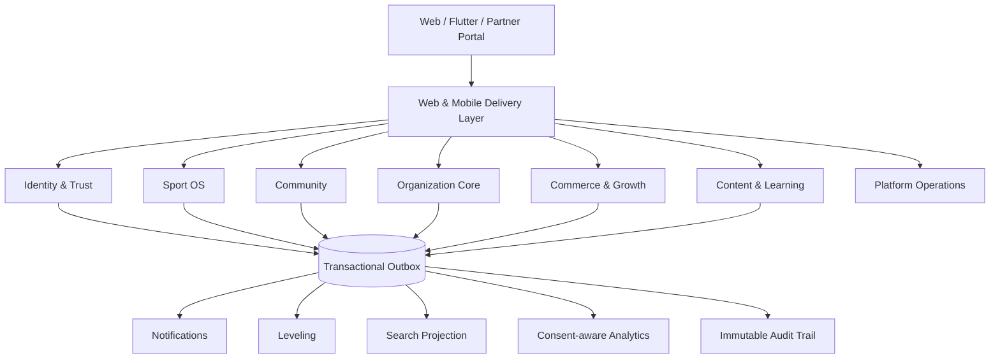
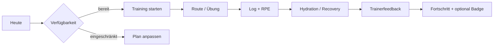

# AIRMIUS – All-in-One-Optimierungsplan 2030

**Status:** Zielbild und umsetzbarer Aktionsplan  
**Stand:** 8. August 2026  
**Adressaten:** Entwicklung, Product Management, UX, Datenschutz, Betrieb und Fachverantwortliche  
**Entscheidungsziel:** Aus der breiten Modulsammlung wird ein integriertes, rollenbasiertes „Sport Operating System“.

> Dieser Plan ist eine technische und produktstrategische Empfehlung, keine Rechtsberatung. Datenschutz, Jugendschutz, Zahlungs- und Vereinsprozesse benötigen vor dem Produktivstart eine dokumentierte Fach- und Rechtsabnahme.

## 1. Executive Summary

AIRMIUS besitzt bereits eine außergewöhnlich breite Funktionsbasis. Im Repository sind unter anderem 1.105 Anwendungsrouten, 151 Controller, 170 Models, 372 Vue-Komponenten, 110 Vue-Seiten, 62 Services, 35 Composables und 154 Tests vorhanden. Laravel, Inertia, Vue, Axios, Reverb/Echo, eine mobile API und vier Sprachkataloge sind etabliert.

Das größte Risiko ist deshalb nicht fehlende Funktionalität, sondern **Produkt- und Architekturfragmentierung**:

- dieselben Geschäftsprozesse werden über Web- und API-Controller teilweise doppelt orchestriert;
- eine sehr lange Navigation spiegelt Module statt Nutzerziele;
- globale Plattformrollen, Vereinsrollen und objektbezogene Freigaben überlagern sich;
- sensible Sport-, Gesundheits-, Standort-, Minderjährigen- und Zahlungsdaten benötigen ein einheitliches Schutzmodell;
- Echtzeit-, Inertia- und Axios-Updates existieren, aber ohne einen durchgängigen Aktualisierungsvertrag;
- technische Übersetzungsabdeckung ist stark, langfristig sollte sichtbarer Text jedoch über semantische Keys statt DOM-Nachübersetzung gesteuert werden.

### Kernentscheidung

AIRMIUS bleibt zunächst ein **modularer Monolith**. Die Module werden in sieben fachliche Domänen mit gemeinsamen Use-Cases, Policies, Events und Datenverträgen gegliedert. Microservices werden nur bei belegtem Skalierungs-, Sicherheits- oder Team-Autonomiebedarf extrahiert.

Die Nutzeroberfläche wird nicht mehr nach Modulen, sondern nach fünf Aufgabenräumen organisiert:

1. **Heute** – persönliche Aufgaben, Termine, Training, Flüssigkeit und offene Entscheidungen.
2. **Planen** – Training, Events, Routen, Kurse und Ressourcen.
3. **Community** – Feed, Story, Chat, Teams und Matching.
4. **Organisation** – Verein, Mitglieder, Recruiting, Dateien, Finanzen und Sponsoren.
5. **Entdecken** – Marketplace, Kurse, Blog, Events und Angebote.

Admin-, Support- und Analysefunktionen erhalten getrennte Operations-Workspaces. Rechte werden serverseitig über „Rolle + Organisation + Ressource + Datenzweck“ entschieden.

## 2. Analysebasis und belegte Ausgangslage

| Bereich | Vorhanden | Bewertung |
|---|---|---|
| Web | Laravel + Inertia + Vue, Tailwind, Design Tokens | Gute Basis für schnelle, partielle Navigation |
| Mobile | gemeinsame Laravel API mit Flutter-Client | Richtiges Zielbild, aber Drift zwischen Web- und API-Orchestrierung vermeiden |
| Aktualisierung | Inertia Partial Reloads, Axios, Reverb/Echo | Fähig, aber einheitliche Mutations- und Cache-Regeln fehlen |
| Rollen | Spatie Permission, Plattformrollen, Vereinsrollen und Einzelrechte | Leistungsfähig, aber drei Scope-Ebenen müssen sichtbar getrennt werden |
| Sprachen | DE, EN, FR, AR; RTL-Unterstützung; große Key-Kataloge | Sehr gute technische Abdeckung; semantische QA und RTL-Realgeräteprüfung bleiben nötig |
| Datenschutz | Export, Löschung, Retention, Guardian Consent, Privacy-Einstellungen | Viele Bausteine vorhanden; als zentraler Privacy Control Plane bündeln |
| UI | responsiv, mehrere Themes, Fokus-Stile, Komponentenbibliothek | Gute Grundlage; Navigation und Informationsdichte vereinheitlichen |
| Qualität | 154 Tests und umfangreiche Readiness-Dokumentation | Gute Basis; Contract-, Policy-, Accessibility- und Journey-Tests ergänzen |

### Haupteffizienzen, die gehoben werden können

1. **Doppelte Orchestrierung:** Web- und API-Controller sollen dieselben Application Actions aufrufen. Controller validieren und serialisieren nur.
2. **Uneinheitliche Namen:** Singular/Plural und Legacy-Namen wie `team.*`/`teams.*`, `event.*`/`events.*` erschweren Audits. Ein kontrolliertes Berechtigungslexikon ist nötig.
3. **Zu viele Einstiege:** 20+ sichtbare Module erhöhen Such- und Entscheidungszeit. Aufgabenbasierte Navigation und eine globale Command Palette reduzieren sie.
4. **Kontextwechsel:** Verein, Team, persönliche Rolle und Sponsor-Kontext brauchen einen persistierenden Workspace-Switcher mit klar sichtbarem Scope.
5. **Datenkopplung:** Gamification, Benachrichtigungen, Feed und Analytics sollten fachliche Domain Events konsumieren, nicht direkt in jedem Kernprozess mitgeschrieben werden.
6. **Sensitivität nicht systemweit sichtbar:** Gesundheits-, Minderjährigen-, GPS- und Finanzdaten benötigen Klassifikation, Zweckbindung, Feldmaskierung und Exportregeln.
7. **UI-Update-Drift:** Optimistische Updates, Fehlertexte, Konfliktbehandlung und Ladezustände sind nicht als ein Vertrag vereinheitlicht.

## 3. Modulaudit und Integrationsvorschläge

| Modul | Aktuelles Potenzial / Ineffizienz | Zielintegration | Priorität und Erfolgskennzahl |
|---|---|---|---|
| Dashboard | Viele Widgets, aber Gefahr eines funktionsorientierten Cockpits | „Heute“-Stream aus Tasks, Deadlines, Ereignissen und Empfehlungen; pro Rolle konfiguriert | P0; erste Kernaktion in < 30 s |
| Ads | Kampagnen, Gruppen, Creatives und Tracking vorhanden; Gefahr isolierter Reportinglogik | Teil von **Growth**; Zielgruppen nur consent- und zweckgebunden, Attribution über gemeinsame Commerce Events | P1; Kampagnenreport in < 2 s, 100 % Consent-Filter |
| Marketplace | umfangreicher Commerce-Stack; kann Navigation dominieren | Teil von **Commerce**; ein Katalog für Produkte, Kurse, Outfit und Sponsorangebote mit unterschiedlichen Produkttypen | P1; Checkout-Abbruch und Supportfälle messbar senken |
| E-Learning | Studio, Kurse, Quiz, Zuweisung und Zertifikate vorhanden | Lerninhalte direkt an Trainingspläne, Teams, Events und Recruiting-Skills anbinden | P1; Kurszuweisung ohne Medienbruch, Abschlussrate |
| Feed / Story | gemeinsamer sozialer Einstieg, aber hohe Moderations- und Jugendschutzlast | Teil von **Community**; ein Audience-Modell für öffentlich, Freunde, Team, Verein und privat | P0; 100 % serverseitige Audience-Policy |
| Chat | Realtime und Medien vorhanden; Kontext aus anderen Modulen muss manuell erklärt werden | Kontext-Chats an Team, Event, Kurs, Bestellung und Supportfall; Deep Links statt Datenkopien | P0; Zustellquote, ungelesene Zeit, Moderations-SLA |
| Training & Dokumentation | fachlich tief; Web/API-Duplikation und viele Teilansichten | Kern von **Sport OS**; Plan → Einheit → Log → Feedback → Analyse als ein Workflow | P0; dokumentierte Einheiten, Planerfüllung, Trainerzeit |
| Outfit-Abo | eigener Abo-, Liefer- und Issue-Stack | Produktvariante in **Commerce**, aber eigene Fulfillment-Subdomain behalten | P2; Lieferfehlerquote, Kündigungsgründe |
| Blog | CMS und Kategorien vorhanden; losgelöst von Kursen/Feed | **Content Hub**; ein Inhalt kann als Blog, Feed-Teaser, Kursreferenz und SEO-Seite ausgespielt werden | P2; Wiederverwendungsquote, organische Conversion |
| Events | Erstellung, Teilnahme, Anwesenheit, Abstimmungen vorhanden | Gemeinsamer Kalender für Training, Wettkampf, Kurs, Vereins- und Sponsor-Event | P0; RSVP-Quote, No-Show-Quote |
| Konto-Abo | mehrere Zielgruppen und Rechnungen | zentrale **Entitlements Engine**; UI prüft Hinweise, Server erzwingt Limits | P0; 0 ungeschützte Premium-Aktion, Conversion |
| Adminbereich | viele einzelne Verwaltungsseiten | drei Workspaces: Platform Ops, Trust & Safety, Revenue Ops; globale Suche und Audit Timeline | P0; Bearbeitungszeit und Fehlerrate |
| Leveling / Badges | Regeln, XP und Badges vorhanden; Manipulations- und Fehlanreizrisiko | konsumiert unveränderliche Domain Events; Anti-Gaming-Limits, keine Belohnung sensibler Offenlegung | P1; Retention ohne Melde-/Spam-Anstieg |
| Team | Mitglieder, Kalender, Chat, Dateien und Strafen vorhanden, aber verteilt | Team Home als Aggregat mit Tabs „Heute, Kalender, Training, Kommunikation, Dateien, Kasse“ | P0; wöchentliche aktive Teams |
| Mitglieder | Import, Beiträge, Rechnungen, SEPA und Austritt sehr umfangreich | **Organization Core**; ein Member Lifecycle mit Statusmaschine und Audit Trail | P0; Importfehler, Verwaltungszeit, offene Fälle |
| File Manager | global einsetzbar; Zugriff und Ablagekontext können unklar werden | Attachments bleiben im Ursprungsmodul sichtbar; Datei-Domain besitzt Binärdaten, Scans, Versionen und Freigaben | P0; 0 unautorisierte Freigaben, Wiederfindezeit |
| Werbeagentur | öffentlicher/vertrieblicher Einstieg, fachlich nicht klar abgegrenzt | als Partner-Workspace in Growth: Mandanten, Kampagnenfreigabe, Budgets, Creatives | P2; Freigabezeit, Kampagnen-ROI |
| Sport-Matching | Suche und Bewerbungen vorhanden; Überschneidung mit Recruiting | Matching für kurzfristige Sportaktivität, Recruiting für längerfristige Rollen; gemeinsame Profile und Trust-Signale | P1; Match-to-Participation-Rate |
| Sponsor | Profile, Workspace und Kampagnen vorhanden | Sponsor CRM mit Assets, Deals, Inventar, Aktivierungen, Event-/Teambezug und aggregierten Outcomes | P1; Renewal Rate, Sponsor Fulfillment |
| Ernährung & Trinken | Mahlzeiten, Ziele, Hydration vorhanden; sensible Daten | an Trainingsbelastung und Tagesplan anbinden, Health-Daten standardmäßig privat | P1; Hydrations-Check-ins, keine Zwecküberschreitung |
| Route planen / Sportkarte | Planung, GPX, Tracking und Orte vorhanden | Trainingseinheit kann Route referenzieren; Event kann Start/Ziel nutzen; Live-Standort nur explizit und zeitlich begrenzt | P0; Routenerfolg, GPS-Batterieverbrauch, Consent |
| Recruiting | Jobs/Interessen und Sportprofil-Bausteine vorhanden | Opportunity Funnel: Bedarf → Match → Bewerbung → Interview/Chat → Teamangebot → Mitgliedschaft | P1; Time-to-fill, Funnel-Conversion |
| Benachrichtigungen | In-App, Realtime, Push/Digest-Grundlagen | zentraler Notification Router mit Präferenzen, Ruhezeiten, Deduplizierung und Prioritäten | P0; Zustellquote, Opt-out, Lärmquote |
| Suche | globale Suche vorhanden | Command Palette + serverseitig sichtbarkeitsgeprüfter Universal Search Index | P1; Trefferzeit und Zero-result-Rate |
| Guardians / Minderjährige | Consent und geschützter Überblick vorhanden | zentraler Safety Scope; altersabhängige Defaults, begrenzte Datenansichten und Zustimmungs-Lifecycle | P0; 100 % geschützte Minor-Aktionen |
| Integrationen | Sportanbieter und Payment/Storage vorhanden | Provider Gateway mit OAuth-Vault, Scopes, Sync-Status, Kosten- und Löschvertrag | P1; Sync-Erfolg, Providerkosten, Widerrufszeit |
| Support | Tickets und SLA-Grundlagen vorhanden | Help Center in jedem Workspace; Kontext-Snapshot ohne dauerhafte Vollkopie sensibler Inhalte | P1; First Response Time, Lösungsquote |

## 4. Zielarchitektur: sieben Domänen statt einzelner Inseln



### 4.1 Domänen und Eigentum

| Domäne | Besitzt | Nutzt referenziell, aber besitzt nicht |
|---|---|---|
| Identity & Trust | Benutzer, Auth, Rollen, Einwilligungen, Guardians, Privacy Requests | Vereinsmitgliedschaft, Sportprofil |
| Sport OS | Sportprofil, Trainingspläne/-logs, Belastung, Verfügbarkeit, Ernährung, Routen | Team, Event, Dateien |
| Community | Posts, Stories, Kommentare, Reaktionen, Chats, Beziehungen, Meldungen | Benutzer-Minimalprofil, Teamreferenz |
| Organization Core | Vereine, Teams, Mitgliedschaften, Recruiting, Beiträge, Anwesenheit | Zahlungen, Dateien, Sportprofilfreigaben |
| Commerce & Growth | Katalog, Warenkorb, Orders, Payments, Konto-/Outfit-Abos, Ads, Sponsoring | Benutzer-/Organisationsreferenz, Content Assets |
| Content & Learning | Blog, Medien-Metadaten, Kurse, Quiz, Zertifikate | Autor, Teamzuweisung, Commerce Order |
| Platform Operations | Konfiguration, Provider, Mail, Support, Moderationsentscheidungen, Systemzustand | nur notwendige, maskierte Projektionen |

### 4.2 Schichten je Domäne

```text
Domain/<Context>/
├── Application/       Actions, Queries, DTOs, Transaktionen
├── Domain/            Regeln, Value Objects, Events, Statusmaschinen
├── Infrastructure/    Eloquent, Storage, Provider, Queue
└── Delivery/
    ├── Web/            Inertia Controller + Page Payload
    └── Api/V1/         API Controller + Resources
```

**Regel:** Web- und API-Controller rufen dieselbe Action auf. Keine Geschäftsregel darf ausschließlich in einem Controller oder Vue-Component leben.

Beispiel:

```text
LogTrainingSessionAction
 ├─ Web TrainingController::store()
 ├─ API TrainingController::store()
 ├─ validiert Policy + Entitlement + Consent
 ├─ schreibt TrainingLog in einer Transaktion
 └─ publiziert TrainingSessionLogged.v1 über Outbox
      ├─ ProgressProjection
      ├─ NotificationRouter
      └─ GamificationConsumer
```

### 4.3 Integrationsregeln

1. Domänen teilen IDs und versionierte Events, nicht beliebige Eloquent-Modelle.
2. Jede Mutation besitzt genau eine Application Action.
3. Jede Action prüft serverseitig Policy, Scope, Entitlement und Datenzweck.
4. Nebenwirkungen laufen nach erfolgreichem Commit über Transactional Outbox und Queue.
5. API Resources und Inertia Payload Builder verwenden gemeinsame DTOs.
6. Externe Provider werden über Ports/Adapter gekapselt und sind idempotent.
7. Dateien gehören technisch dem File Service, fachlich aber immer einem `owner_type`, `owner_id` und `purpose`.

## 5. Integrierte Kern-Journeys

### 5.1 Sportler: „Mein heutiger Sporttag“



- Ein primärer Call-to-Action pro Zustand.
- Gesundheitsnotizen bleiben privat; Trainer sehen nur freigegebene Statusklassen.
- Fehlende Dokumentation wird als hilfreiche Aufgabe, nicht als Strafe dargestellt.

### 5.2 Trainer: „Woche planen und nachbereiten“

- Team wählen → Verfügbarkeit aggregiert sehen → Vorlage instanziieren → Übungen/Routen zuordnen.
- Event- und Trainingskalender teilen dieselbe Zeitachse.
- Anwesenheit und Logs aktualisieren Belastungsprojektionen.
- Feedback wird am Training Log erfasst und im Sportler-Postfach verlinkt.

### 5.3 Verein: „Mitglied vom Antrag bis zum Austritt“

- Antrag → Consent/Guardian-Prüfung → Beitragsvorschau → Freigabe → Teamzuordnung.
- Mitgliedskarte, Beiträge, Dateien, Rollen und Kommunikation entstehen aus derselben Mitgliedschaft.
- Pause/Austritt ist eine explizite Statusmaschine; offene Finanz- oder Zugriffsaufgaben sind sichtbar.

### 5.4 Sponsor: „Partnerschaft messen“

- Sponsorprofil → Deal → Inventar/Assets → Kampagne/Event → Freigabe → Ausspielung.
- Berichte zeigen nur aggregierte, consent-konforme Reichweite; keine individuellen Gesundheits- oder Bewegungsprofile.
- Marketplace-Conversion und Event-Aktivierung verwenden denselben Attribution Contract.

### 5.5 Recruiting: „Vom Bedarf ins Team“

- Verein veröffentlicht Opportunity mit Muss-/Kann-Kriterien.
- Kandidaten geben einzelne Profilfelder zweckgebunden für diese Opportunity frei.
- Matching Score ist erklärbar; keine vollautomatische finale Entscheidung.
- Chat und Angebot referenzieren die Bewerbung; Annahme kann den Mitgliedschaftsprozess starten.

## 6. Rollen- und Berechtigungsmodell

### 6.1 Vier Ebenen einer Autorisierung

```text
Entscheidung = Plattformrolle
            ∩ Workspace-/Organisationsrolle
            ∩ Ressourcenzugriff
            ∩ zulässiger Verarbeitungszweck
            ∩ aktives Entitlement
```

- **Plattformrolle:** z. B. Super-Admin, Support, Analyst.
- **Organisationsrolle:** z. B. Club Owner, Trainer, Finance Manager.
- **Ressourcenbezug:** Besitzer, Teammitglied, Gesprächsteilnehmer, Dateifreigabe.
- **Zweck:** Training, Abrechnung, Support, Sicherheit, Marketing.
- **Entitlement:** Plan und Add-on erlauben die Funktion, ersetzen aber niemals die Policy.

### 6.2 Vorgeschlagene Plattformrollen

| Rolle | Hauptrechte | Explizit ausgeschlossen | Sicherheitsanforderung |
|---|---|---|---|
| Super-Administrator | Break-glass, Rollenmodell, Mandanten-Sperre, Schlüssel-/Security-Konfiguration | kein alltägliches Content-/Support-Arbeiten | Phishing-resistente MFA, Just-in-time-Freigabe, vollständiges Audit |
| Platform Administrator | Benutzerstatus, Sportarten, Systemeinstellungen, Verifikationen | keine Schlüssel, keine Rechteeskalation zu Super-Admin | MFA, getrennte Admin-Session |
| Platform Engineer / Developer | Deploy-/Feature-Flag-/Health-Zugriff, Logs mit Maskierung | standardmäßig keine Produktiv-Personendaten, kein Rollen- oder Finanzzugriff | SSO/MFA, zeitbegrenzter Support Access |
| Security Administrator | Security Events, Sessions, Incident Response, Audit Export | keine Inhaltsbearbeitung, keine Commerce-Mutation | Vier-Augen-Prinzip bei Export/Break-glass |
| Data Analyst | kuratierte, pseudonymisierte Marts, Kohorten und KPIs | keine Roh-Chats, GPS-Tracks, Gesundheitsnotizen, Klarnamen | Query Audit, Mindestgruppengröße, Exportkontrolle |
| Support Agent | Tickets, maskierte Nutzer-/Mandantensicht, Session-Diagnose | keine Rollenvergabe, keine Gesundheits-/Zahlungsdetails | zeitgebundene Fallfreigabe, Reason Code |
| Trust & Safety Moderator | Meldungen, moderationsrelevanter Kontext, Maßnahmen | keine privaten Inhalte ohne Fallbezug | Case Audit, Einspruchsprozess |
| Content Editor | Blog/Kurse/SEO, Review und Publikation | keine Nutzer-, Rollen- oder Finanzverwaltung | Vier-Augen-Publikation optional |
| Commerce Manager | Katalog, Orders, Returns, Payouts | keine Sicherheitsrollen, nur minimale Kundendaten | MFA, Betragsgrenzen, Vier-Augen-Erstattung |
| Sponsor / Agency Manager | eigene Mandanten, Kampagnen, Assets, aggregierte Reports | keine individuellen Nutzerprofile | Workspace-Isolation, Export-Wasserzeichen |

**Migrationshinweis:** `system_admin` kann zunächst als technische Legacy-Rolle bestehen bleiben. `platform_engineer` und `security_admin` werden neu eingeführt; `data_analyst` wird auf kuratierte Datenprodukte begrenzt. Keine pauschalen Wildcards.

### 6.3 Fachrollen

| Rolle | Verein/Team | Training | Mitglieder/Finanzen | Inhalte/Chat | Sensible Daten |
|---|---|---|---|---|---|
| Club Owner | volle Organisation | lesen/zuweisen | verwalten, Delegation | verwalten | nur zweckgebundene Freigaben |
| Club Admin | operativ verwalten | lesen/zuweisen | nach Einzelrecht | moderieren | keine privaten Gesundheitsnotizen |
| Finance Manager | lesen | – | Beiträge, Rechnungen, SEPA | – | nur Abrechnungsdaten |
| Trainer | zugewiesene Teams | planen, dokumentieren, Feedback | Anwesenheit; keine Zahlungsdetails | Teamkommunikation | nur freigegebener Verfügbarkeitsstatus |
| Assistant Coach | zugewiesene Teams | nach Delegation | Anwesenheit | Teamkommunikation | minimal |
| Team Manager | Organisation/Kalender | lesen | Anwesenheit/Kasse nach Recht | Teamkommunikation | minimal |
| Athlete / Member | eigene Teams | eigene Daten | eigene Mitgliedschaft/Rechnungen | Community nach Audience | Kontrolle eigener Freigaben |
| Guardian | verknüpfte Kinder | freigegebene Summen | Consent, ggf. Zahlungen | keine privaten Chats | altersabhängig, minimal |
| Sponsor | verknüpfte Assets/Deals | – | eigene Rechnungen | eigene Kampagnen | nur Aggregate |

### 6.4 Berechtigungskonvention

Neue Berechtigungen folgen `domain.resource.action`, zum Beispiel:

- `organization.members.read`
- `organization.members.manage`
- `sport.training.plan.manage`
- `sport.health.status.read_shared`
- `commerce.refunds.approve`
- `platform.roles.manage`

Legacy-Namen werden über eine Übergangsmatrix abgebildet, mit Deprecation-Warnung protokolliert und nach zwei Releases entfernt. Jede Berechtigung erhält Beschreibung, Risikoklasse, zulässige Scopes und testbare Policy-Beispiele.

## 7. UI-Zielbild 2030

Der visuelle Entwurf liegt als [SVG-Wireframe](presentations/assets/airmius-ui-2030-wireframes.svg) vor.


### 7.1 Desktop-Informationsarchitektur

```text
┌──────────────┬────────────────────────┬──────────────────────────────────────┐
│ Global Rail  │ Workspace-Navigation   │ Kontextfläche                       │
│              │                        │                                      │
│ Heute        │ Team / Verein          │ Tagesfokus + nächste Aktion          │
│ Planen       │ Bereich                │ adaptive Karten und Timeline         │
│ Community    │ Unterbereiche          │                                      │
│ Organisation │ gespeicherte Ansichten │ optional: Kontext-Inspector rechts  │
│ Entdecken    │                        │                                      │
└──────────────┴────────────────────────┴──────────────────────────────────────┘
```

- Global Rail 72 px, Workspace-Navigation 240–280 px, Inhalt max. 1.440 px.
- Command Palette über `⌘/Ctrl + K`: Nutzer, Teams, Funktionen und Aktionen.
- Workspace-Switcher zeigt persönlichen, Vereins-, Team- und Sponsor-Kontext.
- Rechte und Datenschutz sind verständlich erklärt: „Du siehst dies, weil …“.
- Der rechte Inspector öffnet Details, ohne Liste oder Kalender zu verlassen.
- Dichte ist umschaltbar: komfortabel, kompakt; keine separate „Admin-Optik“.

### 7.2 Mobile

- Bottom Navigation: **Heute, Planen, Community, Organisation, Mehr**.
- Eine kontextabhängige primäre Aktion über der Navigation.
- Sheets statt verschachtelter Modals; Fokus wird korrekt eingeschlossen und zurückgegeben.
- Offline-fähige Drafts für Training, Anwesenheit und Uploads; sichtbarer Sync-Status.
- Swipe nur als Zusatz, nie als einzige Bedienmethode.

### 7.3 Designsystem

| Element | Zielstandard |
|---|---|
| Typografie | variable Sans, 16 px Body, klare Zahlen/Tabular Figures, mindestens 1,5 Zeilenhöhe |
| Farbe | semantische Tokens; Status nie nur durch Farbe; Light/Dark/High Contrast |
| Flächen | ruhige Ebenen, subtile Kontur statt starker Glassmorphism-Effekte |
| Radius | 12/16/24 px nach Hierarchie; bestehende Tokens schrittweise harmonisieren |
| Bewegung | 120–220 ms, `prefers-reduced-motion`, keine dekorative Daueranimation |
| Touch | mindestens 44 × 44 CSS-px; Drag immer mit Tastatur-/Button-Alternative |
| Fokus | dauerhaft sichtbarer Fokus; keine Überdeckung durch Sticky Bars |
| Tabellen | responsive Card-Fallback, Spaltenauswahl, Sticky Header, Export mit Berechtigung |
| Formulare | Autosave nur transparent; Dirty State, Undo, serverseitige Feldfehler |
| Status | Skeleton bei initialem Laden, Inline-Progress bei Mutation, verständliche Recovery |

Ziel ist **WCAG 2.2 AA**. Der W3C-Standard ergänzt unter anderem Anforderungen für nicht verdeckten Fokus, Mindestzielgrößen, konsistente Hilfe, redundante Eingaben und zugängliche Authentifizierung. Für E-Commerce-Dienste ist außerdem die Anwendbarkeit der europäischen Barrierefreiheitsanforderungen fachlich zu prüfen.

## 8. Mehrsprachigkeit und RTL als Plattformfunktion

Der aktuelle Bestand DE/EN/FR/AR wird beibehalten und professionalisiert.

### 8.1 Zielregeln

1. UI-Code verwendet semantische Keys wie `training.plan.actions.publish`, nicht deutsche Sätze als dauerhafte IDs.
2. Das Backend liefert Statuscodes (`pending`, `paid`) statt übersetzter Statusstrings.
3. ICU MessageFormat deckt Plural, Geschlecht nur wo fachlich nötig, Zahlen, Datum, Einheit und Währung ab.
4. Locale wird als BCP-47-Wert geführt (`de-DE`, `en-GB`, `fr-FR`, `ar-DE`), mit getrenntem Sprach- und Regionsfallback.
5. Nutzerinhalte speichern `content_locale`; Blog und Kurse erhalten Übersetzungsvarianten mit Veröffentlichungsstatus.
6. Suche nutzt sprachspezifische Analyzer; Synonyme und Sportbegriffe werden kuratiert.
7. Arabisch wird layoutseitig gespiegelt, fachliche Werte wie Zeiten, Strecken und Telefonnummern bleiben korrekt isoliert (`dir="auto"`, Unicode Bidi Isolation).
8. E-Mails, PDFs, Push, Deep Links, API-Fehler und SEO-Metadaten sind Teil derselben Übersetzungsmatrix.

### 8.2 Qualitätssicherung

| Gate | Automatisch | Manuell |
|---|---|---|
| Key-Parität | fehlende/verwaiste Keys, Platzhalter, HTML, Encoding | – |
| Layout | Screenshot-Diff pro Sprache/Viewport | lange Texte, Tabellen, Dialoge |
| RTL | logische CSS Properties, `dir`, Icon-Ausnahmen | Muttersprachler + Realgerät |
| Semantik | Glossar, verbotene Begriffe, Backtranslation-Stichprobe | Fachreview pro Modul |
| Formatierung | Datum, Zahl, Währung, Einheiten | Grenzfälle und PDFs |
| Accessibility | `lang`, Namen/Rollen/Werte, Fokus | Screenreader in DE und AR |

DOM-basierte Autoübersetzung bleibt nur als Übergangsnetz. Neue und geänderte Oberflächen müssen explizite Keys verwenden.

## 9. DSGVO, Jugendschutz und Sicherheit by Design

Die DSGVO verlangt unter anderem Rechtmäßigkeit/Transparenz, Zweckbindung, Datenminimierung, Richtigkeit, Speicherbegrenzung und Sicherheit. Privacy by Design und Default ist laut EDPB eine fortlaufende Pflicht, keine einmalige Checkbox.

### 9.1 Datenklassifikation

| Klasse | Beispiele | Standard | Zusatzkontrollen |
|---|---|---|---|
| P0 Öffentlich | veröffentlichter Blog, öffentliche Vereinsseite | öffentlich nach Freigabe | Publishing Audit, Takedown |
| P1 Intern | Teamkalender, allgemeine Dateien | Organisation/Team | Scope Policy, Sharing Expiry |
| P2 Persönlich | Profil, Chat, Bewerbung | privat bzw. konkrete Audience | Export/Löschung, Maskierung |
| P3 Hochsensibel | GPS, Zahlung, Ausweis-/Verifikationsdaten | privat, Zweckbindung | Feldverschlüsselung, kurze Retention, Access Audit |
| P4 Besonders geschützt | Gesundheit, Verletzung, Minderjährige | strengstes Default | explizite Freigabe, Guardian-Regeln, kein Ad Targeting |

### 9.2 Privacy Control Plane

- **Purpose Registry:** jede Verarbeitung und jedes Feld ist einem Zweck, einer Rechtsgrundlage, Empfängergruppe und Aufbewahrung zugeordnet.
- **Consent Ledger:** versionierte, widerrufbare Einwilligungen; Terms und Marketing getrennt; Nachweis ohne Dark Patterns.
- **Policy Enforcement:** Policies prüfen Datenklasse und Zweck zusätzlich zur Rolle.
- **Retention Engine:** Ablaufregeln pro Datentyp, Legal Hold, Löschvorschau und Nachweis.
- **Privacy Center:** Export, Berichtigung, Einschränkung, Widerspruch, Einwilligungen, aktive Sessions, verknüpfte Provider.
- **Access Ledger:** Nutzer sehen sensible Zugriffe („Wer hat wann aus welchem Grund auf meinen Status zugegriffen?“), soweit rechtlich/operativ zulässig.
- **Vendor Registry:** AVV/DPA, Region, Subprozessoren, Datenkategorien, Lösch- und Incident-SLA.
- **DPIA Gate:** Pflichtprüfung für GPS-Livefunktionen, Gesundheitsauswertung, Minderjährige, Matching/Profiling und personalisierte Werbung.

### 9.3 Konkrete Defaults

- Gesundheits- und Ernährungsdaten: privat; Trainer erhält nur explizit freigegebene, zwecknotwendige Ableitungen.
- Live-Standort: aus, zeitbegrenzt, klarer Indikator, jederzeit stoppbar, automatische Löschung.
- Sponsor-/Ads-Targeting: keine P3/P4-Daten, keine Minderjährigenprofile, keine Cross-Context-Zweckänderung.
- Analytics: pseudonyme Ereignisse; keine Roh-Chats oder exakten GPS-Pfade; Mindestgruppengröße für Reports.
- Support Impersonation: nur Just-in-time, sichtbar, begründet, zeitlich begrenzt und auditiert.
- Exporte: Wasserzeichen, Zweck, Ablauf und Audit; sensible Massendownloads mit Vier-Augen-Freigabe.
- Account-Löschung: verständliche Vorschau, Grace Period, gesetzlich erforderliche Aufbewahrung getrennt und erklärt.

## 10. AJAX, Inertia, Realtime und effiziente Aktualisierung

AIRMIUS benötigt keinen pauschalen Wechsel zu einer anderen Frontend-Technologie. Der vorhandene Stack reicht aus, wenn die Einsatzregeln vereinheitlicht werden.

### 10.1 Entscheidungsbaum

| Situation | Technik | Regel |
|---|---|---|
| Seitenwechsel / Filter / Tabs | Inertia Navigation + Partial Reload | `only`, `preserveState`, URL als Quelle für teilbare Filter |
| kleine Inline-Mutation | Axios/Fetch gegen JSON Action | Optimistic UI nur mit Rollback und Idempotency Key |
| Formular mit Validierung | Inertia Form oder gemeinsamer API-Form-Adapter | ein Fehlerformat, Fokus zum ersten Fehler |
| Chat, Status, Notification | Reverb/Echo | Event enthält minimale Projektion; Reconnect + Catch-up Cursor |
| lange Aufgabe | Queue Job + Status Endpoint/Event | Fortschritt, Abbruch soweit möglich, Ergebnislink |
| selten veränderte Referenzdaten | HTTP Cache + ETag | Sports, Länder, Pläne, Berechtigungslexikon |
| instabile Verbindung | IndexedDB Draft/Outbox | Sync-Zustand und Konflikt sichtbar |

### 10.2 Einheitlicher Mutationsvertrag

```json
{
  "data": {},
  "meta": {
    "request_id": "...",
    "resource_version": 12,
    "updated_at": "2026-08-08T12:00:00Z"
  },
  "errors": [],
  "links": {}
}
```

- `X-Request-ID` für Support und Tracing.
- `Idempotency-Key` bei Create, Payment, Import und mobilen Retries.
- `If-Match`/Resource Version für konfliktgefährdete Bearbeitungen.
- `422` mit stabilen Feldcodes, `403` mit maschinenlesbarem Reason Code, `409` für Konflikte, `429` mit Retry-Hinweis.
- Cursor-Pagination für Feed, Chat und Audit; klassische Pagination für Adminlisten mit direktem Seitensprung.

### 10.3 Client-Datenstrategie

- Ein Composable pro fachlichem Workspace, nicht pro sichtbarem Dialog.
- Serverzustand normalisiert nach Ressourcen-ID; keine zweite Business-Truth im Frontend.
- Optimistische Reaktion/Like/Anwesenheit; pessimistische Zahlung, Rollenänderung, Löschung und Consent.
- Aktualisierungen patchen einzelne Projektionen. Vollständiges `router.reload()` nur als Recovery.
- Echtzeitevents tragen `event_id`, `aggregate_id`, `version`, `occurred_at` und `audience`.
- Nach Reconnect lädt der Client Events ab letztem Cursor; dadurch gehen Änderungen nicht verloren.

### 10.4 Performance-Ziele

| Kennzahl | Ziel p75 |
|---|---:|
| LCP | ≤ 2,5 s |
| INP | ≤ 200 ms |
| CLS | ≤ 0,1 |
| API Read | ≤ 300 ms serverseitig |
| Mutation acknowledgment | ≤ 500 ms ohne Langläufer |
| Realtime fan-out | ≤ 1 s |
| initiales JS pro Workspace | ≤ 250 KB gzip als Budget, danach messen/anpassen |

Maßnahmen: route-basiertes Code Splitting, lazy Panels, Thumbnail-Varianten, N+1-Budgettests, Query-Telemetrie, Redis für kurzlebige Projektionen, CDN nur für öffentliche Assets und konsequente Cache-Invaliderung über Domain Events.

## 11. Umsetzungsplan mit Verantwortlichkeiten

### Phase 0 – Alignment und Sicherheitsbasis (Woche 1–2)

| Schritt | Ergebnis | Responsible | Accountable | Abnahmekriterium |
|---|---|---|---|---|
| 0.1 | Product North Star und Top-5-Journeys | Product Lead | CPO/Projektleitung | Journey-KPIs schriftlich beschlossen |
| 0.2 | Domänenkarte und Architecture Decision Records | Lead Architect | CTO | Ownership aller Kernmodelle eindeutig |
| 0.3 | Datenklassifikation und DPIA-Screening | Privacy Engineer / DSB | Geschäftsführung | P0–P4 für alle Kernobjekte |
| 0.4 | Berechtigungsinventar inkl. Legacy-Mapping | Security Engineer | CTO/DSB | keine unbekannte Hochrisikoberechtigung |
| 0.5 | UX-Baseline mit Aufgabenmessung | UX Research | Product Lead | Zeit/Fehler für fünf Journeys gemessen |

### Phase 1 – Plattform-Fundament (Woche 3–6)

| Schritt | Ergebnis | Responsible | Accountable | Abnahmekriterium |
|---|---|---|---|---|
| 1.1 | gemeinsamer Action-/DTO-Standard | Backend Lead | Lead Architect | Pilotprozess Web/API nutzt dieselbe Action |
| 1.2 | Policy Context mit Plattform, Organisation, Ressource, Zweck | Security + Backend | CTO | deny-by-default und Policy-Tests |
| 1.3 | Transactional Outbox + Event Envelope | Platform Engineer | Lead Architect | keine Nebenwirkung vor Commit; Retry getestet |
| 1.4 | Mutation/Error Contract | Web + Mobile Leads | Lead Architect | gleiches Verhalten in Vue und Flutter |
| 1.5 | i18n-Key-Konvention und CI-Gates | Localization Lead | Product Lead | Key-/Placeholder-/RTL-Gates grün |
| 1.6 | Observability Baseline | SRE | CTO | Request-ID, Traces, SLO-Dashboard, Alarmwege |

### Phase 2 – Neue Shell und Kern-Journeys (Woche 7–12)

| Schritt | Ergebnis | Responsible | Accountable | Abnahmekriterium |
|---|---|---|---|---|
| 2.1 | rollenbasierte App Shell + Workspace Switcher | Frontend Lead + UX | Product Lead | fünf Haupträume, mobil/desktop, WCAG-Test |
| 2.2 | „Heute“-Projection | Sport OS Team | Product Lead | relevante nächste Aktionen < 500 ms API |
| 2.3 | Training-End-to-End auf Shared Actions | Sport OS Team | Backend Lead | Plan → Log → Feedback ohne Controller-Duplikat |
| 2.4 | Team Home | Organization Team | Product Lead | Kalender, Chat, Dateien, Training kontextuell |
| 2.5 | Notification Router | Platform Team | CTO | Preferences, Ruhezeiten, Deduplizierung |
| 2.6 | Privacy Center v2 | Trust Team | DSB | Consent, Export, Löschung, Provider sichtbar |

### Phase 3 – Organisation, Recruiting und Revenue (Woche 13–20)

| Schritt | Ergebnis | Responsible | Accountable | Abnahmekriterium |
|---|---|---|---|---|
| 3.1 | Member Lifecycle State Machine | Organization Team | Product Lead Club | Antrag bis Austritt vollständig auditiert |
| 3.2 | Recruiting Funnel | Organization + Sport Profile | Product Lead | Opportunity bis Angebot messbar |
| 3.3 | vereinheitlichter Commerce-Katalog | Commerce Team | Revenue Lead | Produkt/Kurs/Outfit über gemeinsamen Vertrag |
| 3.4 | Sponsor/Agency Workspace | Growth Team | Revenue Lead | Deal, Asset, Kampagne, Outcome verbunden |
| 3.5 | consent-aware Analytics Marts | Data Team | DSB + Product | keine P3/P4-Rohdaten; Mindestgruppen geprüft |
| 3.6 | Admin Operations Shell | Platform Team | COO/CTO | Fälle statt Modullisten; Audit Timeline |

### Phase 4 – Härtung und Rollout (Woche 21–26)

| Schritt | Ergebnis | Responsible | Accountable | Abnahmekriterium |
|---|---|---|---|---|
| 4.1 | Contract-, Policy- und Journey-Testpaket | QA Lead | CTO | kritische Journeys automatisiert grün |
| 4.2 | WCAG 2.2 AA Audit | Accessibility Specialist | Product Lead | Blocker behoben, Restbefunde terminiert |
| 4.3 | DE/EN/FR/AR und RTL-Abnahme | Localization + native Reviewer | Product Lead | reale Screens und Kernmails freigegeben |
| 4.4 | Security-/Privacy-Test | Security + DSB | Geschäftsführung | Pentest, DPIA, Retention und Incident Drill |
| 4.5 | Pilot mit 3–5 Vereinen | Customer Success | Product Lead | KPI-Baseline verbessert, Rollback möglich |
| 4.6 | stufenweiser Rollout | SRE + Product | CTO | 5 % → 25 % → 100 % via Feature Flags |

## 12. RACI für dauerhafte Verantwortung

| Arbeitsfeld | Product | Architecture | Backend | Web/Mobile | UX | Security/DSB | Data | SRE |
|---|---|---|---|---|---|---|---|---|
| Journey-Priorität | A/R | C | C | C | R | C | C | I |
| Domänengrenzen | C | A/R | R | C | I | C | C | C |
| Berechtigungen | C | C | R | C | I | A/R | I | I |
| Datenschutz | C | C | R | R | C | A/R | R | C |
| Designsystem | A | I | C | R | R | C | I | I |
| API/Event Contract | C | A | R | R | I | C | C | C |
| Analytics | A | C | C | C | C | C | R | C |
| SLO/Incident | I | C | C | C | I | C | C | A/R |

Legende: **R** = Responsible, **A** = Accountable, **C** = Consulted, **I** = Informed.

## 13. Messsystem und Definition of Done

### Produkt-KPIs

- Time-to-First-Value je Rolle.
- Weekly Active Teams/Clubs statt nur Monthly Active Users.
- Anteil geplanter Trainings mit Log und Feedback.
- Verwaltungszeit pro Mitgliedsantrag/Rechnung.
- Event-RSVP- und No-Show-Rate.
- Recruiting Time-to-fill und Sponsor Renewal Rate.
- Supportkontakte pro 100 aktive Nutzer.

### Qualitäts-KPIs

- Policy-Deny- und auffällige Datenexport-Ereignisse.
- Fehlerquote, p95-Latenz, Queue-Alter und Realtime-Reconnects.
- Übersetzungsparität und Screenshot-Diffs.
- WCAG-Verstöße nach Schweregrad.
- Duplizierte Business-Regeln zwischen Web/API.
- Anteil der Mutationen mit Idempotenz, Audit und Contract Test.

### Definition of Done für jede Funktion

1. fachlicher Owner und Datenzweck dokumentiert;
2. Policy-, Entitlement- und Mandantentest vorhanden;
3. DE/EN/FR/AR inkl. RTL und Formatierung geprüft;
4. WCAG 2.2 AA relevante Kriterien geprüft;
5. Lade-, Leer-, Fehler-, Offline- und Konfliktzustand gestaltet;
6. Telemetrie ohne sensible Nutzdaten vorhanden;
7. Retention, Export und Löschung berücksichtigt;
8. Web und Mobile nutzen denselben Application Use-Case;
9. Rollout über Feature Flag und Rollback beschrieben.

## 14. Risiken und Gegenmaßnahmen

| Risiko | Auswirkung | Gegenmaßnahme |
|---|---|---|
| Big-Bang-Refactoring | lange Lieferpause | Strangler Pattern pro Journey, Shared Action zuerst |
| neue Shell verwirrt Bestandsnutzer | Adoption sinkt | Feature Flag, Guided Tour, alte Deep Links weiterleiten |
| Rechte-Migration öffnet Zugriffe | Datenschutz-/Security Incident | deny-by-default, Schattenauswertung, Policy-Diff-Logs |
| Domain Events werden inkonsistent | falsche Benachrichtigung/XP/Analytics | Schema Registry, Versionierung, Contract Tests, Outbox |
| Übersetzungen sind technisch, aber semantisch falsch | Vertrauensverlust | Glossar, native Fachabnahme, keine reine Maschinenfreigabe |
| Gamification erzeugt Fehlanreize | Spam oder Offenlegung | Anti-Gaming, keine XP für sensible Daten, Safety Metrics |
| Sponsor/Ads überschreitet Zwecke | DSGVO-Risiko | harte Datenklassengrenzen, Consent, Aggregate, DPIA |
| Microservice-Frühstart | Betriebs- und Konsistenzkosten | modularer Monolith; Extraktion nur nach messbarem Trigger |

## 15. Erste zehn Tickets

1. ADR: Sieben Domänen und Ownership der bestehenden Models verabschieden.
2. Berechtigungsinventar exportieren und Legacy-/Zielnamen zuordnen.
3. `AuthorizationContext` mit Plattform-, Organisations-, Ressourcen- und Purpose-Scope prototypisieren.
4. Training `store/update` als erste gemeinsame Web/API Action extrahieren.
5. Event Envelope und Transactional-Outbox-Migration implementieren.
6. einheitliches JSON-Fehlerformat in Vue und Flutter integrieren.
7. neue App Shell hinter Feature Flag als Vue-Layout umsetzen.
8. „Heute“-Projection für Sportler und Trainer definieren.
9. semantische i18n-Keys für Shell, Navigation und globale Status einführen.
10. automatisierte Policy-Matrix für Minderjährige, GPS, Gesundheit und Finanzen ergänzen.

## 16. Referenzen und bestehende AIRMIUS-Artefakte

### Intern

- [Produkt-Readiness-Audit](AIRMIUS_PRODUCT_READINESS_AUDIT_2026-07-20.md)
- [Rollenmatrix MVP](AIRMIUS_ROLE_MATRIX_MVP.md)
- [Privacy Rights Process](PRIVACY_RIGHTS_PROCESS.md)
- [Minor Safety Concept](MINOR_SAFETY_CONCEPT.md)
- [Security Review](SECURITY_REVIEW.md)
- [Operations/Monitoring Runbook](OPERATIONS_MONITORING_RUNBOOK.md)

### Offizielle Leitplanken

- [EU-Datenschutz-Grundverordnung, insbesondere Art. 5 und 25](https://eur-lex.europa.eu/legal-content/DE/TXT/?uri=CELEX:32016R0679)
- [EDPB: Privacy by design and by default](https://www.edpb.europa.eu/topics/ai-and-technology/privacy-by-design-and-by-default_en)
- [W3C: Web Content Accessibility Guidelines 2.2](https://www.w3.org/TR/WCAG22/)
- [EU-Richtlinie 2019/882 über Barrierefreiheitsanforderungen](https://eur-lex.europa.eu/eli/dir/2019/882/oj/deu)

## Entscheidungsvorlage

Die Projektleitung sollte jetzt drei Entscheidungen treffen:

1. **Zielsegment:** Vereinsbetrieb + Traineralltag als primärer Pilot, Sportler-App als tägliche Begleitung.
2. **Architektur:** modularer Monolith mit Shared Actions, Policies, Outbox und sieben Domänen.
3. **Umsetzung:** 26-Wochen-Programm in vier Phasen, beginnend mit Rechte-/Datenschutzbasis und der Training-Journey.

Danach kann der Plan direkt in Epics, ADRs und Abnahmetests zerlegt werden.

## Umsetzungsstand 8. August 2026

Die technische Plattformbasis aus Phase 1 und wesentliche Teile aus Phase 2 sind im Repository umgesetzt: API-Vertrag und Idempotenz, Authorization Context, Purpose-Klassifizierung, Domain-Outbox, Least-Privilege-Rollen, Workspace-Kontext, neue App-Shell, Partial Reloads, DE/EN/FR/AR-Shell sowie automatisierte Datenschutz-, Accessibility- und Integrationsprüfungen.

Die verifizierten Betriebs- und Release-Schritte stehen im [Platform Delivery Runbook](AIRMIUS_PLATFORM_DELIVERY_RUNBOOK.md). Fachliche Vollmigration aller Legacy-Texte, native Sprachabnahme, DPIA/Pentest und Pilot-Rollout bleiben bewusst als nachgelagerte Programmphasen bestehen.
